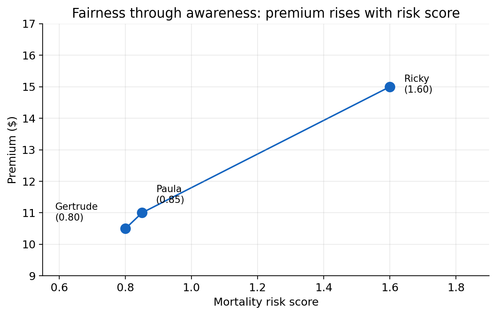
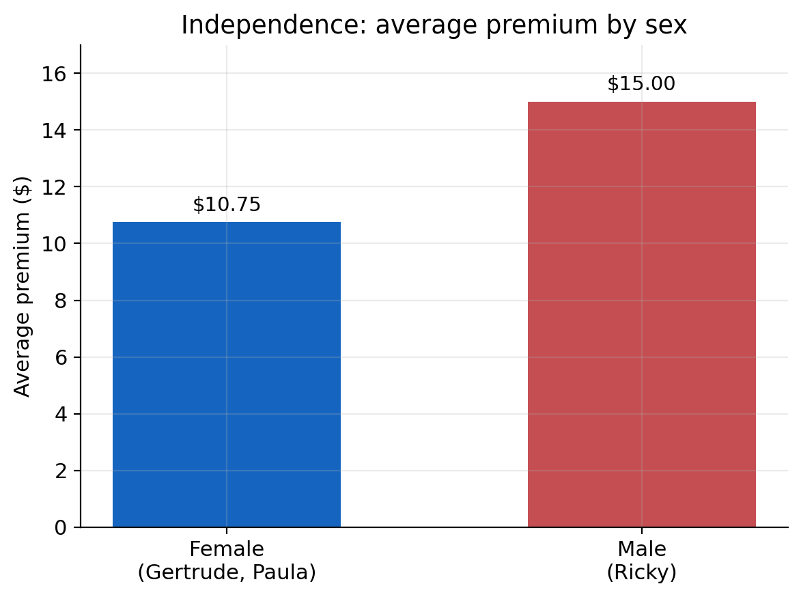
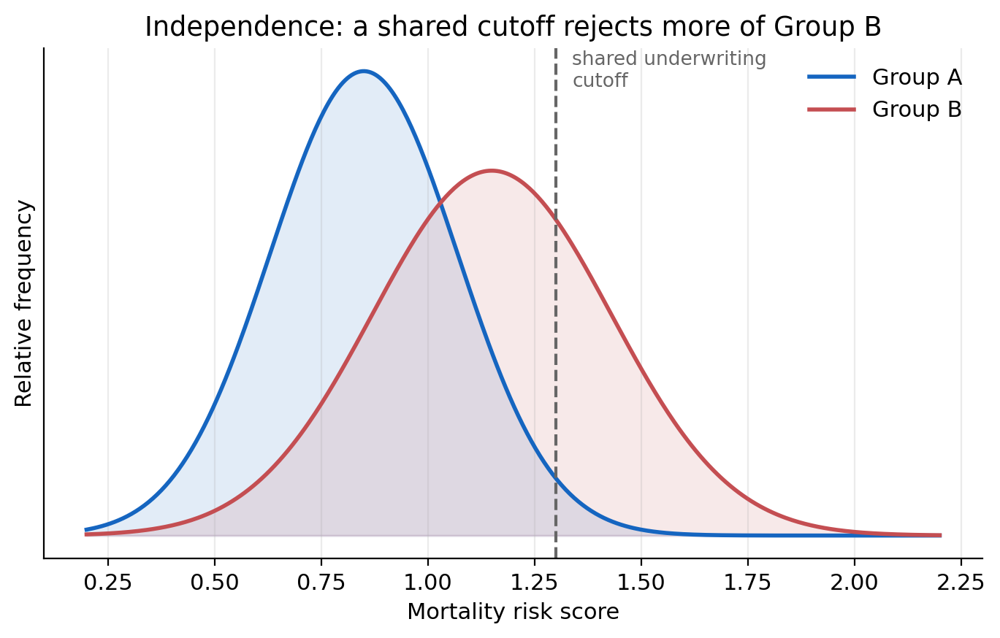
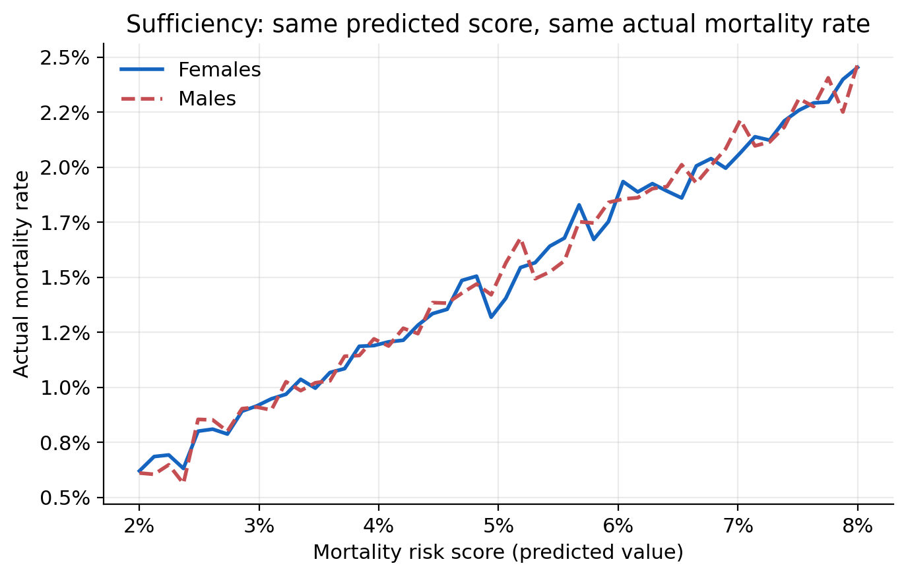
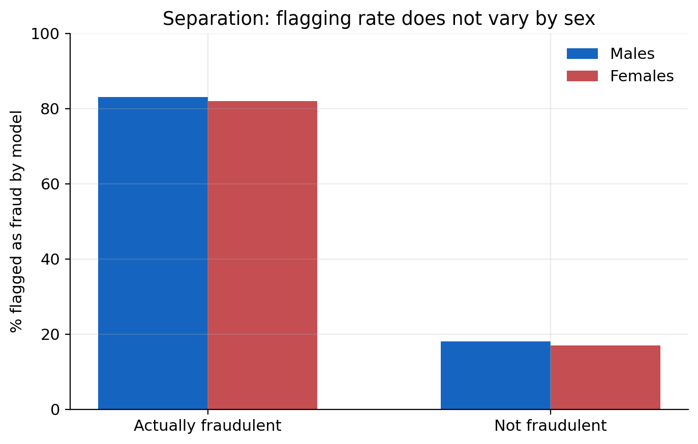

::: {.callout-tip appearance="simple" icon="false"}
## Before you start

Read [Step 1: Define fairness](../Playbook/Step-1-Define-Fairness.html) first for the individual and group fairness taxonomy this case study works through. This case study is a qualitative walkthrough based entirely on @krafcheck2026fairnessmetrics, a Society of Actuaries Research Institute report on fairness metrics for life insurance. It uses one worked example throughout, showing how the same three hypothetical applicants are treated differently depending on which fairness criterion is applied.
:::

# Background

Life insurance fairness raises different questions from the motor insurance case studies elsewhere in this playbook. Underwriting draws on medical, mortality, and lifestyle information rather than claims history and vehicle characteristics, and policies can run for decades before an outcome is observed. Rather than proposing a single fairness definition for life insurers, @krafcheck2026fairnessmetrics address this directly by setting out a framework for choosing among competing definitions and understanding what each one trades away.

The report starts from one distinction that recurs throughout this playbook. **Individual fairness** asks whether similar people are treated similarly. **Group fairness** asks whether outcomes are equal across groups. These are not the same question, and satisfying one does not guarantee the other. @krafcheck2026fairnessmetrics stress that this split is unrelated to the difference between individual and group insurance products. An individual fairness criterion can be tested on a group life policy, and a group fairness criterion can be tested on an individually underwritten policy. What "individual" means here is the most granular risk class the underwriting process actually uses, for example a unique combination of age, sex, and smoking status. What "group" means is any cohort defined for the purpose of the fairness test, whether or not the defining attribute is a protected characteristic.

The report also revisits **actuarial fairness**, the idea that outcomes should be proportionate to expected claim cost. Actuarial fairness can be tested at the individual level, does each policyholder's premium match their own expected cost, or the group level, is the loss ratio consistent across groups. Achieving actuarial fairness at the individual level generally implies it holds at the group level too, but the reverse does not follow. Several of the criteria below sit at different distances from this actuarial fairness benchmark, a point the report returns to throughout.

# A running example {#running-example}

@krafcheck2026fairnessmetrics illustrate each criterion using the same three hypothetical life insurance applicants, and this case study follows the same example throughout so the criteria can be compared directly.

| Applicant | Age | Sex | Smoking | Notable activity | Mortality risk score |
|---|---|---|---|---|---|
| Gertrude Goodrisk | 34 | Female | Non-smoker | Jogging | 0.80 |
| Paula Prudence | 36 | Female | Non-smoker | Yoga and pilates | 0.85 |
| Ricky Riskseeker | 23 | Male | Smoker | Rock climbing, motorcycle racing | 1.60 |

Gertrude and Paula have relatively low, similar mortality risk. Ricky's risk score is roughly double theirs, reflecting his smoking and higher-risk activities. The report uses this example to ask a simple question with several different answers. What should each of these three people pay for life insurance? The answer depends entirely on which fairness criterion is applied.

# Individual fairness criteria {#individual-fairness-criteria}

## Fairness through unawareness {#fairness-through-unawareness}

The most direct interpretation of individual fairness is to leave sensitive characteristics out of the pricing model entirely, so that no protected attribute can directly affect an applicant's premium. @krafcheck2026fairnessmetrics call this fairness through unawareness, also known as fairness through blindness, and note that many insurers already satisfy it by default, either because they do not collect certain protected attributes or because the law prevents them from using it.

Omitting a sensitive attribute does not remove its influence if other variables the model does use are correlated with it. The report's illustration is historical redlining in property and auto insurance, where insurers declined coverage or charged higher rates in zip codes with large racial and ethnic minority populations. No protected characteristic was used directly. Zip code alone drove the outcome, but zip code was correlated with race, so the outcome was still discriminatory. Fairness through unawareness would have been satisfied, and the result was still unfair. For a mortality risk score built from medical claims data, the same risk applies. A diagnosis code correlated with race or ethnicity can carry that information into the score even though race was never an input.

## Fairness through awareness {#fairness-through-awareness}

Fairness through awareness asks a sharper question. Do similar individuals receive similar treatment, where similarity is measured by a chosen metric rather than by group membership? Applied to Gertrude, Paula, and Ricky, the natural similarity metric is the mortality risk score itself, adjusted for any known disparities in access to care.

On this criterion, Gertrude and Paula, with risk scores of 0.80 and 0.85, should be treated similarly, while Ricky, with a risk score of 1.60, should be treated differently and pay a materially higher premium. A pricing pattern where premiums rise smoothly with risk score, Gertrude lowest, Paula slightly higher, Ricky highest, satisfies fairness through awareness. A pattern where Ricky pays the same as or less than Gertrude and Paula, despite his higher score, would not.

{width=75% fig-alt="Premium rising with mortality risk score for Gertrude, Paula, and Ricky"}

@krafcheck2026fairnessmetrics note that fairness through awareness was developed partly as a response to a weakness in group fairness definitions such as demographic parity, covered below. It evaluates whether people who receive the same outcome are actually similar on a task-relevant measure, not whether they belong to the same demographic group. For many insurance applications, this makes it closer in spirit to actuarial fairness than to demographic parity. Its main practical difficulty is choosing the right similarity metric. If the metric itself is blind to group-level disparities, for example if it does not adjust for unequal access to healthcare, fairness through awareness collapses back into fairness through unawareness and provides no additional protection.

## No omitted-variable bias {#no-omitted-variable-bias}

Fairness through awareness still leaves an opening. If the similarity metric or other model inputs correlate with a protected attribute, indirect bias can reappear. The report's response is a criterion it terms no omitted-variable bias. Rather than excluding the protected attribute, this approach includes it directly so that its indirect, proxy effect on other variables can be identified and removed.

@krafcheck2026fairnessmetrics extend the running example to illustrate this. Suppose an insurer wants to confirm that its mortality risk score is not acting as a proxy for sex. Smoking is more common among men, and yoga participation is more than twice as common among women. A model that uses smoking and yoga participation as predictors, without using sex directly, will still partly capture the effect of sex, simply through these correlated variables. Including sex directly as a control variable lets the model separate the pure effect of smoking and yoga participation from the effect that is really attributable to sex.

Diagnosing and correcting for proxy effects requires the direct use of the sensitive characteristic somewhere in the modelling process, whether as a control variable, in an iterative adjustment, or as a post-processing correction. Some stakeholders view any direct use of a protected attribute as inappropriate in itself, even when the purpose is to remove bias rather than introduce it. No single one of the three individual fairness criteria escapes this tension.

This is the same problem this playbook calls proxy discrimination, and the same criterion this playbook calls controlling for the protected variable, CPV (see [Step 1: How the frameworks relate](../Playbook/Step-1-Define-Fairness.html#how-the-frameworks-relate)). [Step 2's MC model](../Playbook/Step-2-Design-Fair-Pricing.html#mc-averaging-over-the-protected-attribute) implements CPV as a post-processing correction, fitting a full model that includes the protected attribute and then averaging predictions over it at scoring time.

# Group fairness criteria {#group-fairness-criteria}

## Independence (demographic parity) {#independence}

Independence, also called demographic parity or statistical parity, asks whether an outcome is statistically independent of group membership. In practice, this means testing whether the group averages match. Continuing the running example, suppose Gertrude, Paula, and Ricky are charged premiums of \$10.50, \$11.00, and \$15.00. The average premium for the two female applicants is \$10.75. The average for the one male applicant is \$15.00, a gap of \$4.25, or about 39.5%. This does not satisfy independence by sex.

{width=65% fig-alt="Bar chart of average premium for females versus males, 10.75 dollars versus 15.00 dollars"}

@krafcheck2026fairnessmetrics work through what closing that gap would require. One option is a single, shared underwriting cutoff applied to a risk score, which independence alone does not achieve if the two groups' risk distributions differ, because a shared cutoff will reject a higher share of whichever group has the riskier distribution. Equalising the rejection rate requires setting different cutoffs for different groups, so that two individuals with the same risk score in different groups can receive different decisions, which most people would regard as a new kind of unfairness, and which some state statutes prohibit outright. The alternative is to strip the model of whatever variables are driving the group difference, which sacrifices predictive accuracy and introduces cross-subsidy. Lower-risk individuals pay more than their own expected cost to offset higher-risk individuals in the same group. Taken to its extreme, community rating removes the variation entirely, which brings its own risk of adverse selection, healthier policyholders exiting the pool as the shared premium rises, driving the premium higher still.

{width=80% fig-alt="Two overlapping risk-score distributions for Group A and Group B with a shared cutoff line rejecting more of Group B"}

Because strict independence is demanding, the report also sets out several relaxed versions.

| Relaxed criterion | Relaxes | Example |
|---|---|---|
| Relaxed demographic parity | Independence, by allowing group averages to differ within a stated bound | One group's price cannot fall below 80% of the other's |
| Conditional demographic parity | Independence, by allowing some correlated but actuarially justified variables to remain in the model | An underwriting model may use a mortality risk score based on prescription and medical claims data, so long as that data is shown to be actuarially relevant |
| Conditional disparate impact | Conditional demographic parity further, by permitting a defined group difference conditional on matching non-sensitive attributes | The expected mortality risk score between two groups, conditional on the same prescription and medical claims data, is permitted to differ by up to 10% |

@krafcheck2026fairnessmetrics note that fairness through unawareness and independence are, in effect, the two extremes of conditional demographic parity. One treats every non-sensitive attribute as legitimate, the other treats none as legitimate.

## Sufficiency {#sufficiency}

Independence says nothing about accuracy. Sufficiency, also called predictive parity, fills that gap. After conditioning on the model's prediction, does the true outcome remain independent of group membership? Applied to the running example, sufficiency asks whether male and female applicants with the same mortality risk score go on to experience the same actual mortality rate. If they do, the model's predictions carry the same meaning for both sexes at any given score, even though the average score, and therefore the average premium, may legitimately differ between them.

{width=75% fig-alt="Actual mortality rate against predicted mortality risk score, with male and female lines coinciding"}

The report ties sufficiency closely to actuarial fairness, since it is testing whether the model is equally well-calibrated across groups rather than whether outcomes are equal. Typical metrics are positive and negative predictive value, compared across groups. Its main limitation for life insurance is practical. Long-duration products with rare, distant claim events make it hard to accumulate enough experience to test calibration reliably at every score level, so testing sufficiency usually requires grouping applicants into broader score bands. The report also notes that sufficiency is a poor fit for any product deliberately designed to cross-subsidise, since sufficiency effectively requires the absence of the very cross-subsidy such products intend to provide.

## Separation {#separation}

Separation flips the conditioning around. After conditioning on the true outcome, is the model's prediction independent of group membership? Because it depends on knowing the true outcome, separation is easier to illustrate with a shorter-tailed process than mortality. The report's example is fraud detection. Take the claims that were actually fraudulent and the claims that were not, and within each set, compare the rate at which the model flagged a claim as fraudulent, by sex. If the flagging rate is similar for men and women within both the fraudulent and the non-fraudulent groups, separation is satisfied. Formally, this means true positive rates and false positive rates that are equal across groups, also called equalised odds.

{width=75% fig-alt="Grouped bar chart of the percentage flagged as fraud by the model, for males and females, split by actual fraud status"}

@krafcheck2026fairnessmetrics are clear that separation trades on the same weakness as sufficiency in the life insurance context, but in the opposite direction. Because it conditions on the observed outcome, it fits classification tasks with observable outcomes, like fraud detection, far better than pricing, where the entire point of the model is to estimate an expected cost that has not yet been, and may never be, observed for a given policyholder.

# Trade-offs and conclusion {#trade-offs}

Applied to Gertrude, Paula, and Ricky, the criteria above do not converge on one answer. Fairness through awareness and sufficiency point toward premiums that track the risk score closely, Ricky paying materially more than Gertrude and Paula. Independence points toward equalising the average premium by sex, which, holding the underlying risk difference constant, requires cross-subsidy in one direction or the other. No omitted-variable bias and separation sit somewhere in between, addressing indirect bias in the inputs or the errors rather than the headline outcome itself.

@krafcheck2026fairnessmetrics draw out why this is unavoidable rather than a flaw in any one criterion. Individual and group fairness are not generally achievable together whenever a group difference is correlated with expected cost. The report's example is male and female life expectancy. Life expectancy differs between men and women in nearly every population, so an insurer cannot simultaneously price everyone according to their own expected cost, actuarial and individual fairness, and hold average premiums equal across sex, independence. One of the two must give way, and which one should give way is a policy and product decision, not a modelling one. The report is equally clear that individual and group fairness are not always in conflict. If the two criteria are defined so that they measure the same underlying quantity, for example equal average premiums and equal accuracy of expected claim cost, and if the underlying risk distributions happen to be similar across groups, both can hold together. Whether they do is a property of the data and the product, not something the choice of metric alone can guarantee.

The report's own conclusion is not a recommendation for one criterion over another. It is a caution against treating any single metric as a complete answer. A model can pass a chosen fairness test and still fail to achieve the ethical outcome stakeholders actually intended, since a technical criterion captures only part of what "fair" means to any given stakeholder. Fairness metrics can also reveal that a disparity exists without explaining why, so passing or failing a test is usually the start of an investigation, not the end of one. And the choice of which model or process to test matters as much as the choice of metric. If a pricing model feeds into a rate that is then adjusted by manual overrides or non-modelled expense loadings, testing the model alone can miss where the actual disparity is introduced, a point that connects directly to the pure premium, technical premium, and market premium distinctions in [Step 2](../Playbook/Step-2-Design-Fair-Pricing.html#scope-of-this-step) of this playbook.

::: {.callout-important appearance="simple" icon="false"}
## For practitioners

@krafcheck2026fairnessmetrics do not endorse a specific fairness definition for life insurance, and neither does this case study. Before selecting a criterion for your own product:

- Confirm whether your regulatory environment or stated product philosophy points toward individual fairness, group fairness, or an explicit combination of both, and note that the two are not always simultaneously achievable when a group difference correlates with expected cost, so a genuine conflict may force a choice rather than a combination (see [Step 1: Social good or economic commodity?](../Playbook/Step-1-Define-Fairness.html#social-good-or-economic-commodity))
- Identify which correlated, non-sensitive variables in your data you consider actuarially legitimate, since this determines where you sit between fairness through unawareness and independence on the conditional demographic parity spectrum
- Decide whether you are testing the underlying model, the final rate, or both, since manual overrides and non-modelled loadings can reintroduce disparities a model-level test will not catch
- Treat a fairness metric result as the start of a due-diligence process, not a compliance conclusion. A pass does not confirm the ethical outcome was achieved, and a fail does not by itself identify the cause
:::

## Checklist

Use this checklist alongside [Step 1's checklist](../Playbook/Step-1-Define-Fairness.html#checklist) when applying these criteria to a real product.

| Task | Typical owner |
|------|---------------|
| Confirm which fairness criterion, or criteria, apply to this product, and document the case for compatibility if more than one is claimed | Executive sponsor / Product |
| Validate the similarity metric or proxy-diagnosis approach the chosen criterion depends on | Actuarial / Data science |
| Identify which correlated, non-sensitive variables you treat as actuarially legitimate, and document why | Legal / Compliance, actuarial |
| Confirm whether fairness testing covers the model, the final rate, or both | Actuarial / Model risk |

## Further reading

- @krafcheck2026fairnessmetrics, full framework, worked example, and literature review this case study is based on
- [Step 1: Fairness criteria](../Playbook/Step-1-Define-Fairness.html#fairness-criteria), how these criteria map onto the playbook criteria used in Steps 2 through 4
- [Case Study: Fair Models](<../Case Study 2/case_study2.html>), a data-driven implementation of the same individual and group fairness criteria on motor insurance data
