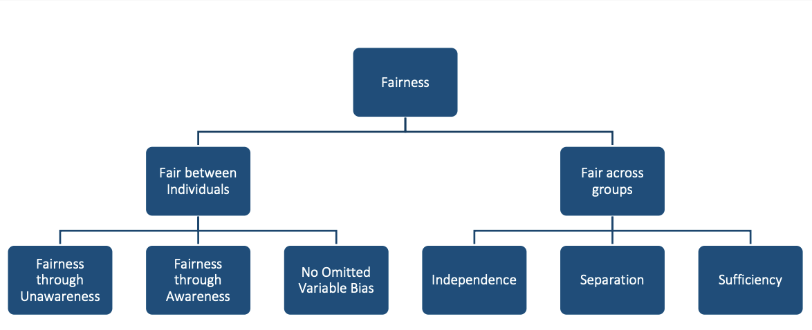
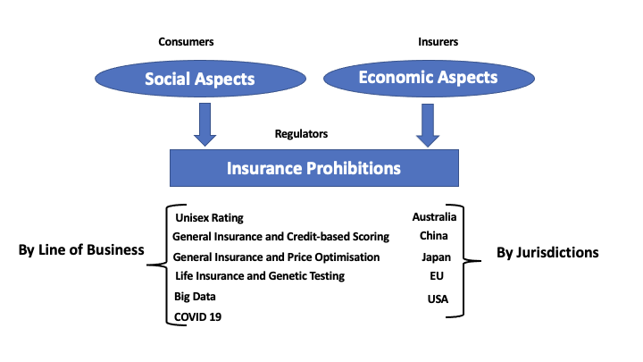

::: {.callout-tip appearance="simple" icon="false"}
## Before you start

This step sets the fairness standard for everything that follows. Steps 2–4 each pair with a case study in the sidebar (insurance applications with technical depth).

Compliance and policy, see [Anti-discrimination](#anti-discrimination) → [Checklist](#checklist). Product strategy, see [Competing ethical notions](#competing-ethical-notions). Technical readers, see [Step 2](Step-2-Design-Fair-Pricing.html) and [Case Study 1](<../Case Study 1/case_study1.html>).
:::

::: {.callout-note appearance="simple" icon="false"}
## Key insights from this step

- There are at least six distinct fairness criteria for insurance pricing, and they cannot all be satisfied simultaneously. Choosing a criterion is a policy and legal decision that must be made before any modelling begins.
- Fairness through unawareness (simply removing the protected attribute from the model) is a common starting point but is not sufficient, and is not required by all fairness criteria. Some criteria, such as controlling for the protected variable (CPV), explicitly use the protected attribute during model training. And even where the attribute is excluded, indirect discrimination persists through correlated proxy variables and opaque algorithms.
- The regulatory spectrum runs from no restriction through prohibition on specific variables to community rating. Each regulatory level maps to a different fairness criterion and a different model design in Step 2.
:::

## What is fair?

Consider a motor insurer that has just removed gender from its pricing model in response to regulatory pressure. The actuarial team is confident the model is fairer than before. But a closer look reveals that postcode, vehicle engine size, and annual mileage are still in the model, and in the data they happen to correlate with gender. The model no longer uses gender directly, but its outputs still reflect it. Has the insurer achieved fairness?

The answer depends entirely on which question you ask. Is the test whether the protected attribute is in the model? Whether average premiums are equal across groups? Whether individuals from different groups are treated the same way given the same risk profile? Different stakeholders, and different legal systems, give different answers. Settling that question is what this step is for.

A useful starting point is the framing of @frees2023discriminating: what are the principles for assessing the appropriateness of insurance differentiation? There is no single answer that fits every product and jurisdiction. This step works through three lenses that together cover the relevant ground. Most of the technical content in this playbook develops the first two. The third deserves attention even when it is not the primary focus.

| Lens | What it emphasises | Where to read |
|------|-------------------|---------------|
| Anti-discrimination | Legal obligation to avoid unfair treatment and unjustified disparate outcomes | [Pricing feature principles](#pricing-feature-principles) through [Fairness criteria](#fairness-criteria) |
| Competing ethical notions | Actuarial fairness, social justice, and how risk should be pooled | [Principles of fair differentiation](#principles-of-fair-differentiation) through [Actuarial fairness](#actuarial-fairness) |
| Consumer trust | Promises made in contracts, disclosures, and market conduct | [Consumer trust](#consumer-trust) (brief) |

These lenses do not always point in the same direction. A pricing system can be legally compliant and still strike many customers as unfair. A system built on actuarial fairness (each customer pays their own expected cost) may produce outcomes that disadvantage historically marginalised groups. A system designed to achieve group parity may charge some customers more than their expected cost warrants, raising questions of efficiency and adverse selection. Working through these lenses is not about finding a single correct answer. It is about making the trade-offs visible so the right people in your organisation can make an informed decision before any model is built.

## Anti-discrimination {#anti-discrimination}

This lens asks whether pricing complies with anti-discrimination law on both how people are rated and what outcomes groups receive, and whether rating variables and model outputs meet recognised fairness tests. The sections below cover how to judge individual rating factors and the quantitative criteria used in later steps.

Many rating variables are routine. Others, such as ethnicity, heritage, or religion, are forbidden in most markets. The hard cases are variables that are legal on their face but may act as proxies for protected attributes, especially under machine learning and large-scale data analytics.

### Pricing feature principles {#pricing-feature-principles}

Deciding whether to use a rating variable is not a purely statistical question. A variable might predict claims reliably yet still be inappropriate to use, while a weaker predictor might be clearly defensible. The six principles below, drawn from @frees2023discriminating, provide a structured way to think through that judgement for any rating factor under review.

| Principle | Question | Illustration |
|-----------|----------|--------------|
| Control | Can the customer influence the feature? | Owning a sports car is partly controllable. Gender, race, and nationality are not. |
| Mutability | Does it change over time or stay fixed? | Age changes. Many sensitive attributes are fixed at birth. |
| Statistical discrimination | Does it predict cost or risk? | Predictive value is necessary but not sufficient for fair use. |
| Causality | Does it cause the priced outcome? | A variable known to cause the insured event (e.g. certain health conditions in life insurance) is easier to defend. |
| Past discrimination | Does use reinforce historical injustice? | Skin colour has a heavier history of misuse than eye colour. |
| Socially valuable behaviour | Does pricing discourage beneficial actions? | Penalising participation in genetic testing may discourage research and prevention. |

Control matters because there is broad consensus that people should not be penalised for characteristics they cannot change. Statistical discrimination matters because a variable with no predictive power is hard to defend on actuarial grounds even if it raises no other concerns. But predictive power alone is not enough: a high-performing predictor can still be problematic if it also fails on causality, history, or socially valuable behaviour.

The most difficult variables tend to be those that score well on some principles and poorly on others. Credit-based insurance scores are a good example. They predict insurance losses reasonably well, but their causal link to claim risk is unclear, they correlate with race and income, and restricting insurance access based on credit history may discourage financially vulnerable people from seeking coverage. Different jurisdictions have reached different conclusions about these scores. That illustrates why the six principles are an input to a judgement, not a rule that replaces it.

Whether a variable is ultimately acceptable depends on line of business and jurisdiction [@frees2023discriminating; @xin2024antidiscrimination]. Gender in pricing is routine in US motor insurance yet prohibited across the EU. Genetic information is a prohibited underwriting factor in health insurance in many countries but remains largely unregulated in life insurance in others. The principles provide the vocabulary for that discussion; legal and compliance teams need to supply the jurisdiction-specific answer.

::: {.callout-important appearance="simple" icon="false"}
## Direct and indirect discrimination

Following @xin2024antidiscrimination, direct discrimination (or disparate treatment) occurs when a person is treated less favourably because a protected characteristic differs. If the protected attribute is not used in rating, this form can be avoided entirely.

Indirect discrimination arises after direct discrimination is ruled out. A person may still be treated disproportionately because protected status is inferred through an apparently neutral practice. Two channels matter in modern pricing:

- Identifiable proxies. Facially neutral variables that stand in for a protected attribute (for example, geographic area correlated with race, or variables correlated with gender)
- Unidentifiable proxies. Opaque models that combine many variables and reproduce protected-group disparities without a single obvious surrogate

EU and Australian law often define indirect discrimination through three elements: a facially neutral provision, criterion, or practice; a connection to a protected characteristic in law; and disproportionate disadvantage for people with that characteristic. That is usually only the first stage. The practice may still be lawful if it is objectively justified (EU) or reasonable in the circumstances (Australia). In the United States, disparate impact plays a parallel role: a neutral policy or practice that disproportionately harms a protected group, often without intent to discriminate. US law does not use the term indirect discrimination, but the structure is similar, including defences such as business necessity where applicable. In all three traditions, disproportionate impact alone does not automatically mean unlawful discrimination; legitimacy and justification also matter.

Algorithmic discrimination (biased outcomes from analytics or machine learning) is generally a form of indirect discrimination. Omitting protected variables from a model ([fairness through unawareness (FTU)](#fairness-criteria)) does not guarantee fair outputs if proxies or complex algorithms remain.

In insurance, some jurisdictions restrict or scrutinise certain proxy variables (such as zip code, credit information, occupation, or education), but rules vary by market and product. Formal approaches to assessing indirect discrimination in quoted premiums are still developing in many places. Where direct protected-class data are unavailable, some regulatory frameworks allow inferred race or ethnicity for quantitative testing. Regression disparities based on such proxies require careful interpretation; see [Step 4](Step-4-Audit-the-System.html#proxied-protected-attributes) and @xin2026proxyrace. Steps 2–4 describe technical options for mitigation and audit that you can adapt to your jurisdiction and governance needs.
:::

### Risk-based and non-risk differentiation {#risk-based-pricing}

Not every price difference reflects expected claim cost. @frees2023discriminating distinguishes risk-based differentiation (premiums that differ because expected losses differ) from non-risk differentiation (premiums that differ for the same underlying risk, for example because of retention modelling, willingness to pay, or price optimization).

Risk-based rating is the norm in actuarial pricing and is usually defended on efficiency grounds. Non-risk differentiation is more contested. It can be lawful in some markets yet still raise fairness concerns when loyal or less sophisticated customers pay more than risk-identical shoppers, or when behavioural factors reproduce group disparities [@xin2024antidiscrimination]. Several U.S. states restrict price optimization for this reason. [Step 3](Step-3-Assess-Impact.html) examines welfare effects when pricing moves beyond technical costs.

### Mini-glossary {#mini-glossary}

Symbols and terms used across Steps 1–4.

| Term | Plain language |
|------|----------------|
| Protected attribute ($X_P$) | A characteristic the law or policy treats as off-limits for direct discrimination (e.g. race, gender, ethnicity) |
| Other features ($X_{NP}$) | Rating variables not treated as protected |
| Predicted outcome ($\hat{Y}$) | The model output you will test. Often an estimated cost or a quoted premium |
| Proxy discrimination (PD) | A non-protected variable acts as a stand-in for a protected attribute |
| Legitimate factors | Risk-related variables regulators accept as grounds for price variation |

### Fairness criteria {#fairness-criteria}

The criteria below are **illustrative examples** used in this playbook and in much insurance fairness work. They are not an exhaustive list. Your jurisdiction, product line, and regulator may require a different criterion.

Let $X_P$ be a protected attribute, $X_{NP}$ other features, and $\hat{Y}$ the predicted price (or cost estimate used to set price) [@xin2024antidiscrimination].

#### Playbook criteria

These are the criteria **implemented in Steps 2–4** of this playbook [@xin2024antidiscrimination].

| Type | Criterion | Definition |
|------|-----------|------------|
| Individual | Fairness through unawareness (FTU) | $\hat{Y}$ does not use $X_P$ |
| Individual | Controlling for the protected variable (CPV) | Average full-model predictions over $X_P$ at scoring time (sometimes called a discrimination-free price) |
| Group | Demographic parity (DP) | Equal distribution of $\hat{Y}$ across protected groups |
| Group | Conditional demographic parity (CDP) | Equal distribution of $\hat{Y}$ across groups within each legitimate subgroup |
| Group | Separation / sufficiency | Equalised prediction errors across groups (separation) or equal calibration of $\hat{Y}$ to outcomes (sufficiency) |

#### Broader taxonomy

@krafcheck2026fairnessmetrics survey a wider set of criteria for life insurance. The taxonomy distinguishes **individual** and **group** fairness.

{width=85% fig-alt="Fairness criteria taxonomy: individual fairness and group fairness branches"}

**Individual fairness** [@krafcheck2026fairnessmetrics]. *Examples below are adapted from the SoA report (life insurance).*

| Criterion | Plain language | Example |
|-----------|----------------|---------|
| Fairness through unawareness | Leave protected or sensitive variables out of the model | No sensitive rating variables used in underwriting |
| Fairness through awareness [@dwork-etal-2012-fairness] | Similar individuals (by a similarity metric that accounts for known disparities) receive similar predictions or prices | Same premium for applicants with the same risk score within a group, after adjusting the score for known disparities (e.g. healthcare access by race or ethnicity) |
| No omitted-variable bias | Diagnose proxy relationships with protected attributes and adjust for their effect on outputs | Remove the effect of race or ethnicity on model outputs after diagnosing proxy relationships |

**Group fairness** [@krafcheck2026fairnessmetrics]. *Examples below are adapted from the SoA report (life insurance).*

| Criterion | Plain language | Example |
|-----------|----------------|---------|
| Independence | $\hat{Y}$ is statistically independent of the protected attribute | Equal rejection rates for life insurance applications across race and ethnicity classes |
| Separation | After conditioning on the true outcome, $\hat{Y}$ is independent of the protected attribute | Equal likelihood of fraud investigation or policy rescission across groups, once controlling for whether fraud was ultimately detected |
| Sufficiency | After conditioning on $\hat{Y}$, the true outcome is independent of the protected attribute | Equal distribution of claims across groups at each estimated mortality risk score |

#### How the frameworks relate

| Playbook criterion | Related criterion in @krafcheck2026fairnessmetrics |
|--------------------|------------------------------------------------------|
| Fairness through unawareness (FTU) | Fairness through unawareness |
| Controlling for the protected variable (CPV) | No omitted-variable bias |
| Demographic parity (DP) | Closely related to independence |
| Conditional demographic parity (CDP) | Special case of independence, conditioning on legitimate factors |
| Separation / sufficiency | Same names in the SoA taxonomy |

Achieving individual and group fairness simultaneously is often impossible [@krafcheck2026fairnessmetrics; @xin2024antidiscrimination]. The trade-off between criteria is itself part of the fairness discussion.

#### Choosing a criterion for your regime

Regulation can constrain **inputs** (which variables or pricing procedures are allowed) or **outputs** (quantitative tests on premiums or costs) [@xin2024antidiscrimination]. Most regimes still emphasise inputs (prohibited or restricted variables). Effects-oriented rules are growing, including unisex pricing in the EU, disparate-impact-style tests in some U.S. proposals, and bans on non-risk price optimization. Prohibition on protected variables often points toward individual criteria (FTU, CPV); disparate-impact or community-rating rules often point toward group criteria (DP, CDP). Match the criterion you adopt to your regime before modelling in [Step 2](Step-2-Design-Fair-Pricing.html).

## Competing ethical notions {#competing-ethical-notions}

This lens asks which differentiations are appropriate in the first place, given how a product is positioned in the market. It is less about legal tests than about solidarity, efficiency, and the social role of insurance. Insurance pricing is not the only place fairness matters. Differentiation also arises in issuance, renewal, cancellation, coverage terms, marketing, and claims handling [@frees2023discriminating]. Refusing to issue or renew cover, or restricting benefits, can harm disadvantaged groups more sharply than premium differences alone.

### Principles of fair differentiation {#principles-of-fair-differentiation}

Algorithmic pricing is built on differentiation. Customers with different expected costs or willingness to pay may receive different prices. The question is which differentiations are appropriate [@frees2023discriminating].

{width=80%}

### Social good or economic commodity? {#social-good-or-economic-commodity}

Fairness depends on product context. The same rating factor can look appropriate in one market and problematic in another.

| Position | Emphasis | Risk pooling logic | Examples |
|----------|----------|-------------------|----------|
| Social good | Solidarity, access, universal service | Subsidising solidarity (higher-risk groups supported by lower-risk groups) | Mandatory coverage, limited risk classification, community rating |
| Economic commodity | Efficiency, adverse selection, moral hazard | Chance solidarity (pooling among similar risks) | Voluntary products priced by supply and demand with finer risk segmentation |

::: {.callout-note appearance="simple" icon="false"}
## Insurance examples

Compulsory third-party motor insurance, catastrophe cover in some jurisdictions, and health insurance are often treated as serving a broader public interest. Premiums may be flattened or pooled across groups.

Voluntary life insurance and voluntary motor cover behave more like competitively priced products. Finer risk classification is usually accepted to limit adverse selection.

Long-term care and disability insurance often sit between the two positions. Your product's regulatory status and consumer expectations should guide which column applies.
:::

### Actuarial fairness {#actuarial-fairness}

Actuarial fairness is the idea that each policyholder should pay for their own risk and only their own risk [@frees2023discriminating]. It is the dominant logic when insurance is sold as a commercial product by a stock insurer, where the pool is a collection of bilateral contracts rather than a shared community. From this perspective, charging a high-risk customer a low-risk premium is unfair to low-risk customers who effectively cross-subsidise them.

The fairness standard shifts with who owns the pool. Government schemes and social insurance routinely accept cross-subsidy as a policy objective. Mutual and takaful arrangements can carry stronger solidarity expectations than stock-company markets, even when those firms compete on similar rating factors.

The conflict between actuarial fairness and solidarity is most visible in health insurance, where most developed countries have moved toward some form of community rating or mandatory risk pooling. In motor insurance, the tension appears when regulators prohibit actuarially justified rating factors. The EU's ban on gender-based pricing in 2012 is the clearest example: the European Court of Justice held that equal treatment of men and women took precedence over gender being a statistically valid predictor of motor claims [@ECJ2011testac]. The ban did not eliminate the underlying risk difference between male and female drivers in certain age groups. It redistributed who pays for it, requiring low-risk female drivers and high-risk male drivers in the same age bracket to pay the same premium. Whether that is fairer depends on whether you view motor insurance as an economic commodity or a social arrangement.

Risk-based pricing and cross-subsidy are both defensible in different product contexts. The key is to make the position explicit before the model is built, rather than discovering it implicitly in the audit.

## Consumer trust {#consumer-trust}

The third lens is about whether pricing honours what the firm has promised customers and what the market expects, not only whether a model passes a legal or statistical test.

Insurers make implicit and explicit commitments through product disclosure, marketing, codes of practice, and the consistency between quoted and filed rates. Insurance contracts also rely on utmost good faith: customers are expected to answer underwriting questions honestly, while insurers hold far more data and modelling capability [@frees2023discriminating]. That imbalance matters for trust. Consumers often struggle to compare policies or verify that a quoted premium reflects risk rather than retention or shopping behaviour.

A price can be compliant yet feel unfair if it diverges from those promises, changes without clear explanation, or uses information gathered for underwriting in ways customers did not expect. Non-risk differentiation, including price optimization that penalises loyal or less price-sensitive customers, is a recurring source of consumer concern [@frees2023discriminating; @xin2024antidiscrimination]. Big data and machine learning can widen the gap if insurers can segment more finely while customers lack equivalent tools to compare offers.

Conversely, transparent communication about why prices differ (for example, risk-based rating on controllable factors) can support trust even where premiums are not equal across groups. Compliance with anti-discrimination rules is necessary but not sufficient for this lens. Product, legal, and communications teams should align on what customers are told about how prices are set and how that aligns with the technical choices in the sections above.

## Checklist {#checklist}

Use this checklist to confirm Step 1 decisions before moving to model design. Assign an owner for each item and record sign-off.

| Task | Typical owner |
|------|---------------|
| Discuss which fairness lenses matter for your product (anti-discrimination, competing ethical notions, consumer trust) | Executive sponsor / Product |
| Document applicable regulations and filing requirements | Legal / Compliance |
| Identify relevant fairness metrics (e.g. conditional demographic parity (CDP), proxy discrimination (PD)) for your context | Product / Policy |
| Specify outcome $\hat{Y}$ and legitimate factors for conditional demographic parity (CDP) | Actuarial / Model risk |
| Classify pricing features using differentiation principles (note line of business and jurisdiction) | Actuarial / Data science |
| Separate risk-based from non-risk pricing practices in disclosures and governance | Product / Actuarial |
| Define how indirect discrimination will be assessed and escalated | Legal / Model risk |
| Align customer-facing disclosures with pricing methodology | Product / Communications |
