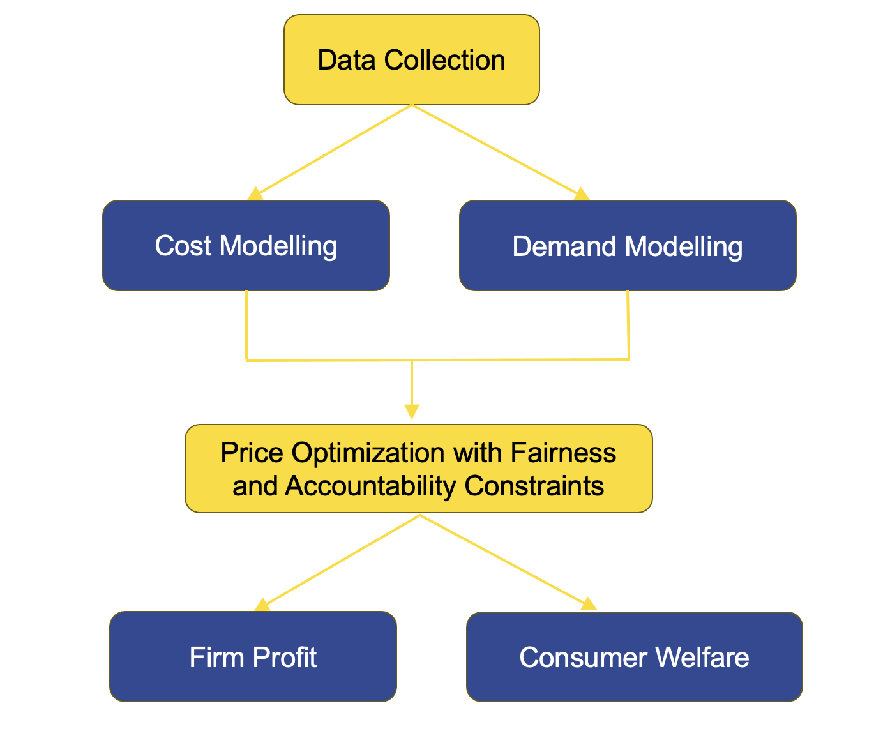

::: {.callout-tip appearance="simple" icon="false"}
## Prerequisite

[Step 2: Design fair pricing](Step-2-Design-Fair-Pricing.html). A fair cost model does not guarantee a fair final price or favourable welfare outcomes.

[Case Study 2: Welfare implications](<../Case Study 2/case_study2.html>) covers demand, price optimisation, and regulation comparison on insurance data.

Policy readers, see [Who gains and loses](#who-gains-and-loses) and [Pricing rules](#pricing-rules). Business readers, see [Measures](#measures) and [Checklist](#checklist). Technical readers, see [Case Study 2](<../Case Study 2/case_study2.html>).
:::

::: {.callout-note appearance="simple" icon="false"}
## Key insights from this step

- A fair cost model does not guarantee a fair outcome. Price optimisation, demand elasticity (how sensitive customers are to price changes), and competitive dynamics can reintroduce group disparities after cost-level fairness is achieved. Prediction-level fairness is a necessary starting point, not a sufficient end state.
- Demographic parity on premiums (PDP) closes price gaps between protected groups but can simultaneously widen markup disparities, resolving one form of inequality while creating another. The trade-off is structural, not a modelling error.
- No single pricing rule achieves both price fairness and markup fairness at the same time. Which trade-off is acceptable is ultimately a policy decision that actuaries and compliance teams must make explicit, not a parameter to optimise away.
:::

## Who gains and loses? {#who-gains-and-loses}

Steps 1 and 2 focus on the model: what it predicts and how it treats different groups at the point of estimation. Step 3 asks a different question. Once fair predicted costs leave the model and enter the market, who actually benefits and who ends up worse off?

The distinction matters because insurance prices are not simply the output of a cost model. They also reflect demand, competition, customer behaviour, and the insurer's commercial objectives. A pricing system that achieves cost-level fairness can still produce unfair market outcomes if the firm's pricing strategy shifts the burden in ways the fairness constraint was not designed to catch.

Consider a simple example. An insurer builds a model that produces equal average predicted costs for two groups. It then applies a price optimisation layer that raises prices for customers who are likely to renew regardless of cost. If one protected group is disproportionately represented among those low-switching customers, perhaps because of fewer alternatives in their local market or lower financial literacy, the final premiums will be higher for that group even though the cost model was fair. The fairness constraint was applied at the wrong stage of the pipeline. It addressed the model but not the market outcome.

This step asks you to trace the impact of pricing decisions through to the customer, measuring welfare and profit by protected group rather than stopping at whether predicted costs are equal.

::: {.callout-important appearance="simple" icon="false"}
## For practitioners

Welfare assessment compares alternative pricing rules to show who gains and loses. In your market

- Demand and price-setting assumptions must reflect your product and distribution channel
- Price optimisation may be restricted or prohibited in some jurisdictions. Use it here for policy analysis, not as operational guidance without legal review
- The regulatory labels used below (PA, POB, and so on) map to different rules in different countries. Treat them as a conceptual taxonomy

The [case study](<../Case Study 2/case_study2.html>) illustrates one insurance market with a real dataset. Your filing or board memo should use your own data and market structure.
:::

::: {.callout-note appearance="simple" icon="false"}
## Insurers without price optimisation

Welfare analysis applies even if your pricing process does not include a demand model or optimisation layer. Without price optimisation, the pipeline simplifies to expected cost plus a loading for expenses and profit. The welfare questions remain the same. The analysis is more straightforward.

**What to measure.** For each model design from Step 2 (M0, MU, MCDP, MC), compute average premiums and markups by protected group. The markup is the difference between the premium charged and the expected claim cost: the loading the customer pays above their risk. Check whether the loading is applied uniformly across groups or whether it varies by factors that correlate with protected attributes, even unintentionally.

*Firm profit* per policy is the premium minus the expected claim cost. This can be computed directly from the pricing model and the filed or quoted premium, and averaged by protected group. A markup gap exists if one group systematically pays a higher loading per unit of expected cost than another.

*Consumer welfare* is willingness to pay minus the premium charged. Willingness to pay is not directly observed without a demand model, but it can be approximated in several ways. If the market is reasonably competitive, the current premium is a rough proxy for willingness to pay for continuing policyholders, who revealed by their decision to buy or renew that they value cover at least at that price. Renewal rates by group provide a related signal: a group with lower renewal rates at the same premium may have lower willingness to pay or fewer alternatives. Where competitor quotes are available, the gap between the insurer's price and the market price gives another approximation. In the absence of any demand data, reporting firm profit by group is the minimum useful output. Consumer welfare can then be flagged as a qualitative risk rather than a precise estimate.

**Cross-subsidy under fairness rules.** The five pricing rules below (P0 through PAF) can be read as a policy analysis frame rather than an operational description. For example, asking what demographic parity on premiums (PDP) would require tells you which group would cross-subsidise the other and by how much, even if you never run an optimisation model to implement it.

**Participation effects.** Without a demand model, participation effects cannot be quantified precisely, but they should still be considered qualitatively: are there groups for whom the fair-model premium is substantially higher than under the baseline, and might that affect their ability or willingness to retain cover?

**Practical output.** A welfare memo for a non-optimising insurer can compare premium and markup distributions by group across model designs, document any cross-subsidy implications, and note participation risks (without requiring demand data or an optimisation solver).
:::

::: {.callout-note appearance="simple" icon="false"}
## Scope of this step

- Focuses on predicted welfare and profit after pricing rules are applied
- Does not replace the Step 4 statistical audits of deployed prices
- Assumes a fair cost model from Step 2 as input
:::

## What is price optimisation? {#price-optimisation}

Technical prices in insurance are built on expected claim cost: the amount the insurer expects to pay on a policy over its term. Actuaries estimate this cost using the kind of models described in Step 2, and the premium is typically set close to that estimate plus a margin for expenses and capital.

Price optimisation goes further. It incorporates a model of customer demand: how likely each customer is to buy, renew, or leave in response to a price change. An insurer that can predict which customers are price-sensitive and which are price-insensitive can adjust premiums accordingly, maximising revenue or profit rather than simply recovering expected cost. Customers predicted to be loyal and unresponsive to price increases are charged more. Customers predicted to be price-sensitive and likely to shop around are charged less, or offered discounts at renewal.

This technique is common in retail and travel. In insurance it is more contentious. Around 20 US states have restricted or banned price optimisation in personal lines products since 2015, on the grounds that it creates price differences between customers with identical risks, and that the customers who bear the highest markups (the difference between what they pay and their expected claim cost) tend to be those with fewer choices and less market power [@POWhitePaper; @CFA]. In the UK, the Financial Conduct Authority banned insurers from charging higher renewal prices than those offered to risk-identical new customers, effective from 1 January 2022, on similar grounds [@FCA2021Rule]. Both restrictions target non-risk pricing, though the UK ban specifically targets the renewal channel. If price sensitivity correlates with income, location, or other characteristics associated with protected groups, optimising on price sensitivity can reproduce group-level disparities through a channel that looks entirely neutral from a cost-modelling perspective.

This is why welfare analysis in Step 3 matters even when Step 2 produces a well-designed fair cost model. The model is only the beginning of the pricing pipeline.

## The full pricing process {#full-pricing-process}

@huang2026welfareaccountable models the complete pipeline from cost estimation to market outcome.

{fig-alt="Pricing flow: data collection, cost and demand modelling, price optimisation with fairness constraints, firm profit and consumer welfare" width=85%}

| Stage | Role |
|-------|------|
| Cost modelling | Expected claim cost (input to pricing) |
| Demand modelling | Customer's willingness to pay and sensitivity to price |
| Price optimisation | Offered price in the market, incorporating demand and competitive position |
| Regulatory constraints | Fairness and accountability rules applied to the final price |

Cost modelling is the domain of Step 2. Demand modelling requires data on how customers respond to price offers, which may come from renewal databases, quote conversion rates, or surveys. Price optimisation combines the two to set a price for each customer. Regulatory constraints then apply rules to what that price can look like, which is the focus of the pricing rules in this step.

The welfare outcome for any customer is the difference between their willingness to pay and the price they are actually charged. For the insurer, the profit outcome is the difference between the price charged and the expected cost. Fairness analysis asks whether these quantities differ systematically across protected groups, and whether the regulatory rule chosen narrows or widens those differences.

## Five pricing rules and who wins under each {#pricing-rules}

@huang2026welfareaccountable compares five distinct approaches to price-setting and measures their effects on consumer welfare and firm profit by protected group. The table below summarises each rule.

| Rule | Plain language | Regulatory idea |
|------|----------------|-----------------|
| P0 | Unconstrained profit maximisation | Benchmark: prices set to maximise expected profit, incorporating demand models |
| PA | Accountable pricing | Transparent base rate and explicit relativities for each rating factor |
| POB | Price optimisation ban | Premium tied closely to estimated cost; demand-based markups restricted |
| PDP | Demographic parity on premiums | Equal average premiums across protected groups |
| PAF | Group fairness on cost estimates | Equal premiums across groups within each cost stratum |

**P0: The unconstrained benchmark.** The insurer maximises expected profit, charging each customer based on expected cost and predicted price sensitivity. No fairness constraint applies. This produces the widest disparities between groups and the highest average profit for the insurer. It is the baseline against which all constrained rules are compared.

**Accountable pricing (PA).** This requires a transparent, decomposable rating structure: a base rate plus explicit relativities for each factor, similar to how most traditional filed rate plans work (rate structures submitted to and approved by state insurance regulators) [@POWhitePaper; @NAIC2012]. The insurer cannot add a hidden demand-based surcharge on top of the filed rate. PA limits the ability to exploit information asymmetries but does not directly constrain group-level outcomes. The empirical results in @huang2026welfarealgorithms find that PA nearly eliminates the markup gap between genders, reducing the female-to-male markup ratio from 1.21 under unconstrained pricing to 1.07 (a ratio above 1.0 means females are paying more in markup per unit of expected cost than males; 1.21 means 21 per cent more), because the accountability requirement prevents fine-tuned individual exploitation. This improvement comes at a substantial profit cost. In voluntary insurance markets, the insurer's profit falls by around 42 per cent under PA, making the fairness gain expensive from the insurer's perspective.

**Price optimisation ban (POB).** POB requires that premiums track estimated cost closely, restricting the insurer from adding demand-based markups. The effect on group disparities depends on market structure. In voluntary markets with active competition, POB tends to benefit groups that were previously paying inflated renewal premiums. In mandatory markets where customers cannot easily leave, the dynamics differ and POB's benefits are less predictable. Across the scenarios studied in @huang2026welfareaccountable, POB produces moderate profit losses of around 5 to 8 per cent.

**Demographic parity on premiums (PDP).** PDP directly constrains average premiums to be equal across protected groups [@xin2022]. It is the most direct regulatory response to an observed price gap. It works at the price level, not the cost level, which creates a structural tension described in the next section. Community rating schemes in some jurisdictions apply similar logic: private health insurance in Australia and compulsory third-party auto insurance in the Australian Capital Territory both mandate price parity across risk groups [@ausGovt2023]. The research finds that while PDP achieves near-perfect price equality, it substantially widens the markup gap, raising the female-to-male markup ratio from 1.21 to 1.66 in the baseline market. In the empirical study, females experience welfare losses under PDP even as their prices become equal to males, because the insurer compensates for the price constraint by extracting more profit from the lower-cost group.

**Group fairness on cost estimates (PAF).** Rather than equalising average premiums across groups, PAF requires that within each cost stratum (customers grouped by their estimated claim cost level), customers from different groups receive the same premium [@dolman2018algorithmicIFOA; @dolman2019summit]. This is tighter than PDP in some respects (it controls for risk level) and looser in others (it does not constrain the overall average). The research suggests PAF performs better than PDP on markup fairness for some market structures, at a comparable cost to firm profit, though females can still face welfare losses under PAF where markup differentials remain.

## The price-fairness and markup-fairness tension {#price-markup-tension}

One of the most important findings of this research is that price fairness and markup fairness pull in opposite directions, and no single pricing rule achieves both at once.

**Price fairness** means that two groups are charged similar premiums on average. **Markup fairness** means that two groups are charged a similar margin above their expected claim cost. If the groups have genuinely different expected costs (which is common in motor or health insurance), you cannot achieve both simultaneously.

To see why, consider a simple illustration. Group A has an expected cost of 800 and Group B has an expected cost of 1,000. A regulation that requires equal premiums might set the price at 900 for both. Group A now pays a markup of 100 above their expected cost. Group B pays 100 below theirs. The price gap has been closed. A markup gap has opened. The insurer is effectively cross-subsidising Group B using premiums from Group A.

The PDP rule in @huang2026welfareaccountable achieves exactly this. It closes the premium gap between groups but widens the markup gap. Whether that cross-subsidy is acceptable is not a statistical question. It is a question about whether insurance for this product is being treated as a commercial product (in which case actuarial fairness says each group should pay its own expected cost) or as something closer to a social service (in which case some cross-subsidy is appropriate). That conversation belongs in Step 1, before the model is built and before a pricing rule is chosen.

::: {.callout-note appearance="simple" icon="false"}
## Worked example

Markup is the gap between the premium charged and the expected claim cost. A regulation that equalises premiums across groups may still leave one group paying a higher markup relative to their risk, while the other group receives an implicit discount. This is a redistribution, not a removal of disparity.
:::

## Key findings from the research {#key-findings}

@huang2026welfarealgorithms and @huang2026welfareaccountable together produce five findings that should inform welfare analysis in practice.

First, interventions at the cost-modelling stage can alter final prices even when their effect on model accuracy is modest. The pathway from a fairness constraint to a market price runs through demand and optimisation, and the amplification or attenuation along that path depends on the product and market.

Second, standard fairness metrics can reduce welfare for protected groups after accounting for selection effects. When a pricing rule changes who participates in the insurance market (because some customers find the price too high and drop out), the welfare calculation changes. A rule that equalises premiums for those who buy may still disadvantage the group with the lowest participation rate, because those who cannot afford to participate receive no benefit.

Third, firm and consumer welfare respond differently to each pricing rule. PA tends to reduce markup disparities but at the largest profit cost of any rule studied (around 42 per cent profit loss), making the fairness gain expensive from the insurer's perspective. POB has market-structure-dependent effects. PDP closes price gaps but widens markup gaps. No rule dominates on all dimensions simultaneously.

Fourth, the qualitative findings are robust across voluntary and compulsory market structures. The JRI paper compares a voluntary monopoly market (where consumers can choose not to insure) with a compulsory market (where consumers must hold cover and can switch between competing insurers), and finds the fundamental trade-offs are remarkably similar in both settings. Market structure matters at the margins, but the choice of regulatory rule is the primary driver of outcomes.

Fifth, when fairness rules apply industry-wide rather than to a single firm, the welfare consequences for protected groups are substantially amplified. A consumer who faces a fairness-induced price distortion at one insurer can no longer escape by switching to an unregulated competitor. In @huang2026welfarealgorithms, the welfare loss for female consumers under a fairness-unawareness rule is roughly eight times larger when all insurers face the same constraint than when only one does. Regulators considering mandatory industry-wide mandates should account for this amplification, particularly in markets where consumers have limited outside options.

## Measures {#measures}

Report the following quantities by protected group before proceeding to the audit in Step 4.

| Measure | Definition |
|---------|------------|
| Consumer welfare | Willingness to pay minus price paid. Positive means the customer values the product more than they pay for it |
| Firm profit | Price charged minus expected claim cost. Higher than zero means the insurer earns a margin on this customer |
| Price gap | Difference in average premiums between protected groups |
| Markup gap | Difference in average markup between protected groups |
| Participation rate | Share of each group that purchases or renews. Welfare measures only capture those who participate |

## Checklist {#checklist}

Use this checklist to document welfare findings before auditing. Assign an owner for each item and record sign-off.

| Task | Typical owner |
|------|---------------|
| Welfare memo with firm profit and consumer welfare by group | Actuarial and economics |
| Price gap and markup gap both reported and distinguished | Product and policy |
| Market structure documented (mandatory cover, competition, distribution channel) | Product and strategy |
| Participation rates by group documented | Actuarial |
| Trade-offs linked to Step 4 monitoring plan | Model risk and compliance |
