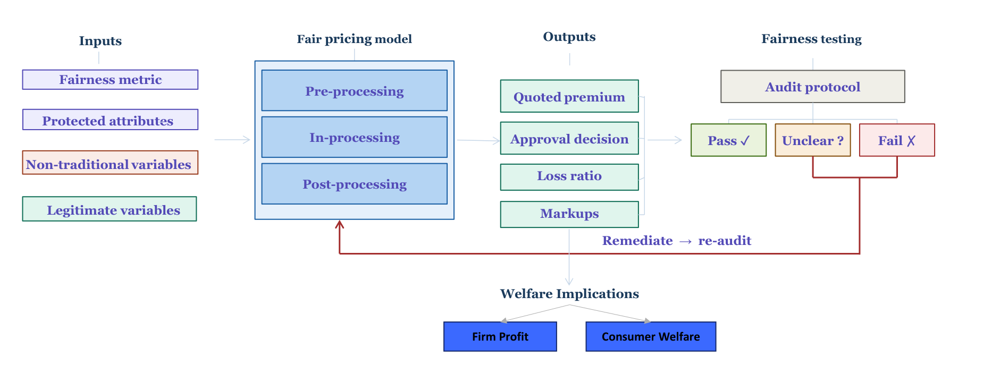
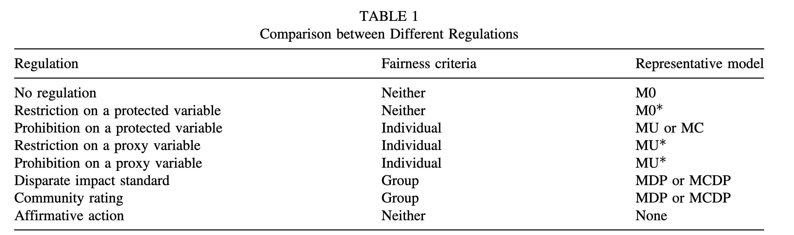
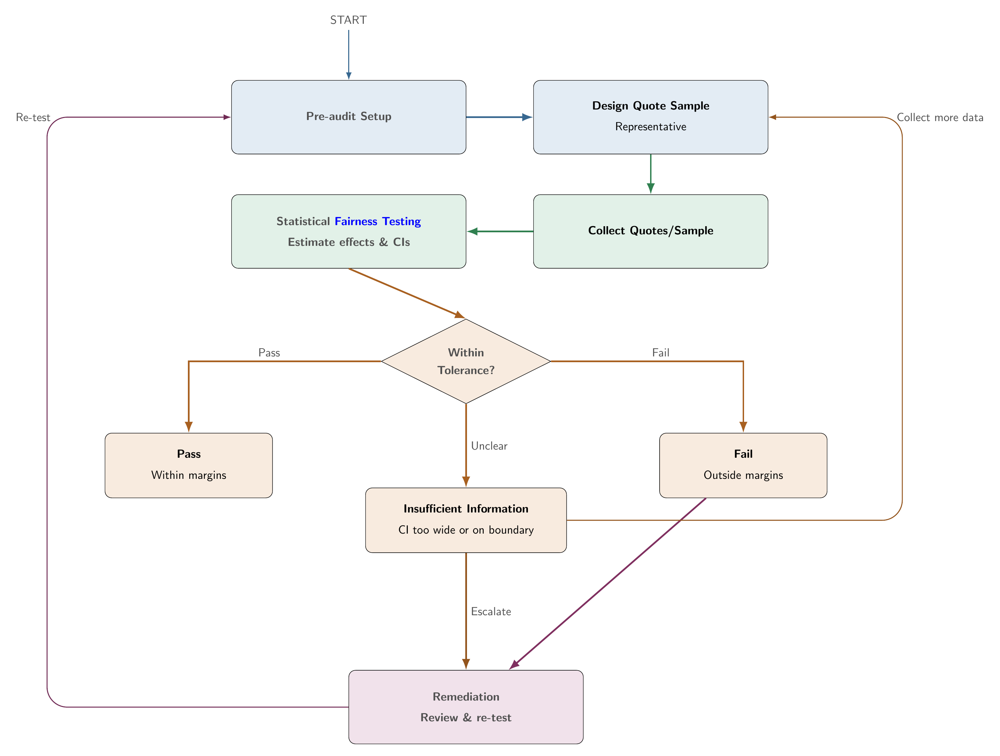

## Abstract

Algorithmic pricing is now common in insurance and financial services, but practical guidance for translating fairness principles into deployable workflows remains fragmented. This report presents The Fair Pricing Playbook, a four-step framework linking fairness definition, model design, welfare assessment, and post-deployment audit into one end-to-end process. The framework centers the anti-discrimination lens while keeping actuarial fairness, solidarity, and consumer trust visible in governance decisions.

Three technical case studies provide implementation evidence. Case Study 1 applies five anti-discrimination model designs (M0, MU, MDP, MCDP, and MC) to French motor insurance data using GLMs and XGBoost, comparing fairness and predictive accuracy across criteria. Case Study 2 extends the analysis to the full pricing pipeline and evaluates five pricing regulations (P0, PA, POB, PDP, PAF) in terms of consumer welfare and firm profit by gender on a 2,000-policyholder French subsample. Case Study 3 implements conditional demographic parity (CDP) and proxy discrimination (PD) audits with corrected statistical inference on Illinois auto insurance quote data, showing that classical OLS standard errors can be substantially wrong for deterministic pricing outputs.

The goal is operational clarity: how to choose a fairness criterion, map it to modeling interventions, evaluate market consequences, and run statistically valid compliance audits. The full playbook, including interactive case studies, implementation checklists, and reproducible code, is available at [fair.feihuang.org](https://fair.feihuang.org).

**Keywords:** algorithmic pricing, insurance, fairness, anti-discrimination, welfare analysis, audit, responsible AI.

## Introduction

AI-driven pricing systems are now widely used in insurance and other financial services. Their appeal is clear. They offer better risk segmentation, faster decisions, and potentially better matching between risk and price. At the same time, these systems can reproduce or amplify discriminatory patterns through proxy variables, complex model interactions, and opaque optimization pipelines. This creates a governance gap between predictive performance and fairness accountability.

In regulated settings, fairness is not a single model constraint. It is a sequence of decisions spanning criterion selection, model design, market behavior, and post-deployment testing [@frees2023discriminating; @xin2024antidiscrimination]. A model can satisfy one fairness notion and still produce adverse outcomes once final prices incorporate loadings, demand response, and regulatory rules [@huang2026welfarealgorithms; @huang2026welfareaccountable]. Likewise, an audit can fail if statistical inference is mis-specified even when design intent is sound [@huang2026fairtesting].

Regulatory attention has intensified across jurisdictions. In the United States, Colorado's Division of Insurance and New York's Department of Financial Services have each issued proposals requiring insurers to evaluate whether algorithmic pricing systems produce discriminatory pricing outcomes [@doradoi-2023-concerning; @nydfs-2024-proposed]. These proposals operationalize fairness tests, including conditional demographic parity and proxy discrimination, that map directly to the audit methodology in Step 4 of this framework.

This report introduces The Fair Pricing Playbook, a practical four-step framework linking these decisions into one auditable workflow. Section 2 situates the work in related literature. Section 3 gives the framework overview. Section 4 presents the methodology for each step in depth, including formal definitions, model taxonomies, welfare measures, and audit statistics. Section 5 describes the companion case studies in detail, including data, implementation choices, and illustrative findings. Section 6 summarizes contributions, and Section 7 discusses limitations.

## Background and Related Literature

### Fairness in Insurance Pricing

What makes a price fair? @frees2023discriminating frame the question as follows: what are the principles for assessing the appropriateness of insurance differentiation? They distinguish risk-based differentiation, where premiums differ because expected losses differ, from non-risk differentiation, where prices diverge for the same underlying risk due to retention modeling, willingness to pay, or price optimization. Risk-based rating is typically defended on efficiency grounds. Non-risk differentiation raises fairness concerns when it reproduces group disparities or penalizes loyalty.

@xin2024antidiscrimination formalize anti-discrimination principles for insurance pricing, distinguishing direct discrimination (explicit use of protected attributes) from indirect discrimination (disparate outcomes through proxy variables or complex model interactions). They propose a taxonomy of model designs (M0, MU, MDP, MCDP, MC) that links specific fairness criteria to concrete modeling interventions. They also show that omitting protected attributes (fairness through unawareness) does not prevent indirect discrimination if correlated proxies remain.

@krafcheck2026fairnessmetrics extend this taxonomy to life insurance, surveying a broader set of individual and group fairness criteria and mapping them to the independence, separation, and sufficiency frameworks from the algorithmic fairness literature. A key finding is that individual and group fairness criteria are often mutually incompatible, satisfying one typically requires violating another.

### Welfare and Market Effects of Fairness Interventions

A separate literature examines what happens to consumers and insurers when fairness constraints are applied. @huang2026welfarealgorithms show that fairness interventions at the cost-model stage do not translate uniformly into welfare improvements at the market stage. Using a discrete-choice demand framework applied to French motor insurance data, they find that some standard fairness metrics can *reduce* welfare for the protected group after selection effects and demand response are taken into account, and that firm-versus-consumer trade-offs vary substantially by intervention type.

@huang2026welfareaccountable develop a complete pricing pipeline model that incorporates cost modeling, demand modeling, price optimization, and regulatory constraints, and evaluate five pricing regulations (P0, PA, POB, PDP, PAF) in terms of premium gaps, markup gaps, consumer welfare, and insurer profit. A central finding is that premium fairness and markup fairness are in tension, no single regulation achieves both simultaneously. PDP closes premium gaps but can widen markup disparities for the group it is designed to protect.

### Audit Methodology for Algorithmic Pricing

@huang2026fairtesting develop the audit methodology used in Step 4. They identify a key statistical problem. Deterministic pricing algorithms always return the same price for the same input profile, so audit regression residuals represent model approximation error rather than independent sampling variability. Classical OLS standard errors, which assume i.i.d. errors, can be wrong in both magnitude and direction. They prescribe HC3 sandwich standard errors for CDP audits and a full cross-covariance correction for proxy-discrimination tests. They also argue for equivalence testing (TOST) rather than conventional significance testing for compliance auditing, because a non-significant result under conventional testing is not positive evidence of fairness. It only means a gap was not detected.

@xin2026proxyrace examine the consequences of using proxied protected attributes (BISG, BIFSG, zip-code composition) in audit regressions. Proxy misclassification mixes group effects, and estimated gaps can be attenuated toward the majority group even when overall proxy accuracy appears high. Proxy errors can correlate with geography and pricing residuals, further distorting disparity estimates.

### Positioning

Compared with these contributions, the playbook's role is integrative. It provides an operational bridge from policy framing to modeling choices, welfare analysis, and audit execution for practitioners across compliance, actuarial, data science, and governance functions, assembling the decisions that must be made in sequence and in a coherent order to produce a defensible fair-pricing system.

## Framework Overview

The framework has four linked steps. Table 1 summarizes each step, the governing question it answers, and the type of output it produces.

| Step | Topic | Governing question | Primary output |
|------|--------|--------------------|----------------|
| 1 | Define fairness | What does fair mean here? | Documented criterion, scope, legitimate factors |
| 2 | Design fair pricing | How can the criterion be achieved? | Fair cost model (M0/MU/MDP/MCDP/MC) |
| 3 | Assess impact | Who gains and loses after prices are set? | Welfare and profit analysis by protected group |
| 4 | Audit the system | Does the deployed system pass or fail? | Pre-committed audit verdict: pass / fail / insufficient information |

: Table 1. The four steps of the Fair Pricing Playbook.

The logic is sequential, with each step providing inputs to the next. Step 1 fixes the fairness criterion and governance scope before any modeling begins. This choice constrains what model designs are permissible in Step 2 and what tests are run in Step 4. Step 2 translates that criterion into a model intervention. Step 3 evaluates whether cost-model fairness carries through to final prices. Step 4 applies pre-committed statistical tests to deployed pricing outputs.

Three design principles underpin the framework. First, protocol choices must be fixed before reviewing outcomes because post-hoc changes to criteria, tolerance margins, or sample definitions undermine auditability and stated error-rate control. Second, fairness evaluation must span the full pricing pipeline rather than stopping at the cost model, so welfare analysis in Step 3 is not optional. Third, audit inference must match the statistical properties of the outputs, and deterministic algorithmic pricing requires corrected standard errors.

Figure 1 illustrates the pathway from model design through fairness testing, as displayed on the companion website.

{width=90% fig-alt="Pathway towards fairness diagram"}

## Methodology

### Step 1, Define Fairness

This step sets the fairness standard for everything that follows. Steps 2 through 4 each pair with a case study (insurance applications with technical depth).

#### What is fair?

Fairness is an overloaded word. A useful place to start is the question posed by @frees2023discriminating: what are the principles for assessing the appropriateness of insurance differentiation?

There is no single answer that fits every product and jurisdiction. The point is to keep this question in view as you work through the three lenses below. Most of this step develops the anti-discrimination lens and the competing ethical notions. Consumer trust deserves attention even when it is not the main technical focus.

| Lens | What it emphasises |
|------|-------------------|
| Anti-discrimination | Legal obligation to avoid unfair treatment and unjustified disparate outcomes |
| Competing ethical notions | Actuarial fairness, social justice, and how risk should be pooled |
| Consumer trust | Promises made in contracts, disclosures, and market conduct |

These lenses overlap but do not always agree. A price can be actuarially fair yet fail a disparate-impact test, or satisfy regulators yet erode consumer trust.

#### Anti-discrimination

This lens asks whether pricing complies with anti-discrimination law on both how people are rated and what outcomes groups receive, and whether rating variables and model outputs meet recognised fairness tests. The sections below cover how to judge individual rating factors and the quantitative criteria used in later steps.

Many rating variables are routine. Others, such as ethnicity, heritage, or religion, are forbidden in most markets. The hard cases are variables that are legal on their face but may act as proxies for protected attributes, especially under machine learning and large-scale data analytics.

##### Pricing feature principles

When judging whether a rating factor is appropriate, @frees2023discriminating propose six principles. Use them to classify variables before modelling.

| Principle | Question | Illustration |
|-----------|----------|--------------|
| Control | Can the customer influence the feature? | Owning a sports car is partly controllable. Gender, race, and nationality are not. |
| Mutability | Does it change over time or stay fixed? | Age changes. Many sensitive attributes are fixed at birth. |
| Statistical discrimination | Does it predict cost or risk? | Predictive value is necessary but not sufficient for fair use. |
| Causality | Does it cause the priced outcome? | A variable known to cause the insured event (e.g. certain health conditions in life insurance) is easier to defend. |
| Past discrimination | Does use reinforce historical injustice? | Skin colour has a heavier history of misuse than eye colour. |
| Socially valuable behaviour | Does pricing discourage beneficial actions? | Penalising participation in genetic testing may discourage research and prevention. |

Whether a variable is acceptable depends on line of business and jurisdiction, not on the six principles alone [@frees2023discriminating; @xin2024antidiscrimination]. Credit-based insurance scores, gender in pricing, and genetic information illustrate how the same factor can be routine in one market and restricted in another.

##### Direct and indirect discrimination

Following @xin2024antidiscrimination, direct discrimination (or disparate treatment) occurs when a person is treated less favourably because a protected characteristic differs. If the protected attribute is not used in rating, this form can be avoided entirely.

Indirect discrimination arises after direct discrimination is ruled out. A person may still be treated disproportionately because protected status is inferred through an apparently neutral practice. Two channels matter in modern pricing. First, identifiable proxies are facially neutral variables that stand in for a protected attribute, such as geographic area correlated with race or variables correlated with gender. Second, unidentifiable proxies arise when opaque models combine many variables and reproduce protected-group disparities without a single obvious surrogate.

EU and Australian law often define indirect discrimination through three elements, a facially neutral provision, criterion, or practice, a connection to a protected characteristic in law, and disproportionate disadvantage for people with that characteristic. That is usually only the first stage. The practice may still be lawful if it is objectively justified (EU) or reasonable in the circumstances (Australia). In the United States, disparate impact plays a parallel role, a neutral policy or practice that disproportionately harms a protected group, often without intent to discriminate. US law does not use the term indirect discrimination, but the structure is similar, including defences such as business necessity where applicable. In all three traditions, disproportionate impact alone does not automatically mean unlawful discrimination. Legitimacy and justification also matter.

Algorithmic discrimination (biased outcomes from analytics or machine learning) is generally a form of indirect discrimination. Omitting protected variables from a model (fairness through unawareness (FTU)) does not guarantee fair outputs if proxies or complex algorithms remain.

In insurance, some jurisdictions restrict or scrutinise certain proxy variables (such as zip code, credit information, occupation, or education), but rules vary by market and product. Formal approaches to assessing indirect discrimination in quoted premiums are still developing in many places. Where direct protected-class data are unavailable, some regulatory frameworks allow inferred race or ethnicity for quantitative testing. Regression disparities based on such proxies require careful interpretation. See Step 4 [@xin2026proxyrace]. Steps 2 through 4 describe technical options for mitigation and audit that you can adapt to your jurisdiction and governance needs.

##### Risk-based and non-risk differentiation

Not every price difference reflects expected claim cost. @frees2023discriminating distinguish risk-based differentiation (premiums that differ because expected losses differ) from non-risk differentiation (premiums that differ for the same underlying risk, for example because of retention modelling, willingness to pay, or price optimization).

Risk-based rating is the norm in actuarial pricing and is usually defended on efficiency grounds. Non-risk differentiation is more contested. It can be lawful in some markets yet still raise fairness concerns when loyal or less sophisticated customers pay more than risk-identical shoppers, or when behavioural factors reproduce group disparities [@xin2024antidiscrimination]. Several U.S. states restrict price optimization for this reason. Step 3 examines welfare effects when pricing moves beyond technical costs.

##### Mini-glossary

The notation below is used consistently across Steps 1 through 4. Protected attributes, legitimate factors, and the predicted outcome $\hat{Y}$ reappear in the model designs in Step 2 and in the audit regressions in Step 4.

| Term | Plain language |
|------|----------------|
| Protected attribute ($X_P$) | A characteristic the law or policy treats as off-limits for direct discrimination (e.g. race, gender, ethnicity) |
| Other features ($X_{NP}$) | Rating variables not treated as protected |
| Predicted outcome ($\hat{Y}$) | The model output you will test. Often an estimated cost or a quoted premium |
| Proxy discrimination (PD) | A non-protected variable acts as a stand-in for a protected attribute |
| Legitimate factors | Risk-related variables regulators accept as grounds for price variation |

##### Fairness criteria

The criteria below are **illustrative examples** used in this playbook and in much insurance fairness work. They are not an exhaustive list. Your jurisdiction, product line, and regulator may require a different criterion.

Let $X_P$ be a protected attribute, $X_{NP}$ other features, and $\hat{Y}$ the predicted price (or cost estimate used to set price) [@xin2024antidiscrimination].

**Playbook criteria.** These are the criteria **implemented in Steps 2 through 4** of this playbook [@xin2024antidiscrimination].

| Type | Criterion | Definition |
|------|-----------|------------|
| Individual | Fairness through unawareness (FTU) | $\hat{Y}$ does not use $X_P$ |
| Individual | Controlling for the protected variable (CPV) | Average full-model predictions over $X_P$ at scoring time (sometimes called a discrimination-free price) |
| Group | Demographic parity (DP) | Equal distribution of $\hat{Y}$ across protected groups |
| Group | Conditional demographic parity (CDP) | Equal distribution of $\hat{Y}$ across groups within each legitimate subgroup |
| Group | Separation / sufficiency | Equalised prediction errors across groups (separation) or equal calibration of $\hat{Y}$ to outcomes (sufficiency) |

**Broader taxonomy.** @krafcheck2026fairnessmetrics survey a wider set of criteria for life insurance. The taxonomy distinguishes **individual** and **group** fairness.

![Fairness criteria taxonomy (individual and group fairness). Adapted from [@krafcheck2026fairnessmetrics].](Playbook/plot/fairness1.png){width=85% fig-alt="Fairness criteria taxonomy"}

**Individual fairness** [@krafcheck2026fairnessmetrics]. *Examples below are adapted from the SoA report (life insurance).*

| Criterion | Plain language | Example |
|-----------|----------------|---------|
| Fairness through unawareness | Leave protected or sensitive variables out of the model | No sensitive rating variables used in underwriting |
| Fairness through awareness | Similar individuals (by a similarity metric that accounts for known disparities) receive similar predictions or prices | Same premium for applicants with the same risk score within a group, after adjusting the score for known disparities (e.g. healthcare access by race or ethnicity) |
| No omitted-variable bias | Diagnose proxy relationships with protected attributes and adjust for their effect on outputs | Remove the effect of race or ethnicity on model outputs after diagnosing proxy relationships |

**Group fairness** [@krafcheck2026fairnessmetrics]. *Examples below are adapted from the SoA report (life insurance).*

| Criterion | Plain language | Example |
|-----------|----------------|---------|
| Independence | $\hat{Y}$ is statistically independent of the protected attribute | Equal rejection rates for life insurance applications across race and ethnicity classes |
| Separation | After conditioning on the true outcome, $\hat{Y}$ is independent of the protected attribute | Equal likelihood of fraud investigation or policy rescission across groups, once controlling for whether fraud was ultimately detected |
| Sufficiency | After conditioning on $\hat{Y}$, the true outcome is independent of the protected attribute | Equal distribution of claims across groups at each estimated mortality risk score |

**How the frameworks relate**

| Playbook criterion | Related criterion in [@krafcheck2026fairnessmetrics] |
|--------------------|------------------------------------------------------|
| Fairness through unawareness (FTU) | Fairness through unawareness |
| Controlling for the protected variable (CPV) | No omitted-variable bias |
| Demographic parity (DP) | Closely related to independence |
| Conditional demographic parity (CDP) | Special case of independence, conditioning on legitimate factors |
| Separation / sufficiency | Same names in the SoA taxonomy |

Achieving individual and group fairness simultaneously is often impossible [@krafcheck2026fairnessmetrics; @xin2024antidiscrimination]. The trade-off between criteria is itself part of the fairness discussion.

**Choosing a criterion for your regime.** Regulation can constrain **inputs** (which variables or pricing procedures are allowed) or **outputs** (quantitative tests on premiums or costs) [@xin2024antidiscrimination]. Most regimes still emphasise inputs (prohibited or restricted variables). Effects-oriented rules are growing, including unisex pricing in the EU, disparate-impact-style tests in some U.S. proposals, and bans on non-risk price optimization. Prohibition on protected variables often points toward individual criteria (FTU, CPV). Disparate-impact or community-rating rules often point toward group criteria (DP, CDP). Match the criterion you adopt to your regime before modelling in Step 2.

#### Competing ethical notions

This lens asks which differentiations are appropriate in the first place, given how a product is positioned in the market. It is less about legal tests than about solidarity, efficiency, and the social role of insurance. Insurance pricing is not the only place fairness matters. Differentiation also arises in issuance, renewal, cancellation, coverage terms, marketing, and claims handling [@frees2023discriminating]. Refusing to issue or renew cover, or restricting benefits, can harm disadvantaged groups more sharply than premium differences alone.

##### Principles of fair differentiation

Algorithmic pricing is built on differentiation. Customers with different expected costs or willingness to pay may receive different prices. The question is which differentiations are appropriate [@frees2023discriminating].

{width=80%}

##### Social good or economic commodity?

Fairness depends on product context. The same rating factor can look appropriate in one market and problematic in another.

| Position | Emphasis | Risk pooling logic | Examples |
|----------|----------|-------------------|----------|
| Social good | Solidarity, access, universal service | Subsidising solidarity (higher-risk groups supported by lower-risk groups) | Mandatory coverage, limited risk classification, community rating |
| Economic commodity | Efficiency, adverse selection, moral hazard | Chance solidarity (pooling among similar risks) | Voluntary products priced by supply and demand with finer risk segmentation |

Compulsory third-party motor insurance, catastrophe cover in some jurisdictions, and health insurance are often treated as serving a broader public interest, with premiums flattened or pooled across groups. Voluntary life insurance and voluntary motor cover behave more like competitively priced products, where finer risk classification is usually accepted to limit adverse selection. Long-term care and disability insurance often sit between the two positions. A product's regulatory status and consumer expectations should guide which column in the table above applies.

##### Actuarial fairness

Actuarial fairness is the idea that each policyholder should pay for their own risk and only their own risk [@frees2023discriminating]. It is the dominant logic when insurance is sold as a commercial product by a stock insurer, where the pool is a collection of bilateral contracts rather than a shared community.

The fairness standard shifts with who owns the pool. Government schemes and social insurance often accept cross-subsidy between groups. Mutual, group, and takaful arrangements can carry stronger solidarity expectations than stock-company markets, even when firms compete on similar rating factors. The social good vs economic commodity table above is one way to read this tension. Risk-based pricing and cross-subsidy are both defensible in different product contexts.

#### Consumer trust

The third lens is about whether pricing honours what the firm has promised customers and what the market expects, not only whether a model passes a legal or statistical test.

Insurers make implicit and explicit commitments through product disclosure, marketing, codes of practice, and the consistency between quoted and filed rates. Insurance contracts also rely on utmost good faith, customers are expected to answer underwriting questions honestly, while insurers hold far more data and modelling capability [@frees2023discriminating]. That imbalance matters for trust. Consumers often struggle to compare policies or verify that a quoted premium reflects risk rather than retention or shopping behaviour.

A price can be compliant yet feel unfair if it diverges from those promises, changes without clear explanation, or uses information gathered for underwriting in ways customers did not expect. Non-risk differentiation, including price optimization that penalises loyal or less price-sensitive customers, is a recurring source of consumer concern [@frees2023discriminating; @xin2024antidiscrimination]. Big data and machine learning can widen the gap if insurers can segment more finely while customers lack equivalent tools to compare offers.

Conversely, transparent communication about why prices differ (for example, risk-based rating on controllable factors) can support trust even where premiums are not equal across groups. Compliance with anti-discrimination rules is necessary but not sufficient for this lens. Product, legal, and communications teams should align on what customers are told about how prices are set and how that aligns with the technical choices in the sections above.


### Step 2, Design Fair Pricing

Agree on the fairness criterion from Step 1 before choosing a model.

This step focuses mainly on the anti-discrimination lens from Step 1. It covers how to build models that meet legal and statistical fairness criteria (FTU, DP, CDP, CPV, and related designs). Questions about solidarity, actuarial fairness, and consumer trust still matter, but the technical work here is about fair cost modelling, estimating expected claim cost or pure premium ($\hat{Y}$).

In production, practitioners often need final prices that also reflect expenses, cost of capital, reinsurance, profit loadings, and other commercial components. These can be incorporated into the pricing process, and the fairness criterion from Step 1 can be applied to final prices as well as to pure premium. For demand modelling, price optimisation, and welfare effects once prices reach the market, see Step 3 and Case Study 2.

Case Study 1 provides an insurance implementation at the cost-modelling stage (GLMs and XGBoost).

#### How can fair pricing be achieved?

Once Step 1 fixes the fairness criterion, choose where in the pipeline to enforce it. Adjust inputs before modelling (pre-processing), constrain the model during training (in-processing), or adjust outputs after prediction (post-processing). Each approach maps to a standard model design (M0 through MC below).

Implement anti-discrimination strategies at pre-processing, in-processing, or post-processing, linked to the fairness criteria from Step 1 [@xin2024antidiscrimination]. This step describes standard model designs rather than a single approved pipeline for every market. Before fitting, practitioners should confirm which criterion from Step 1 is binding (CDP, DP, FTU, or another rule), which variables count as legitimate rating factors under local law, and whether pre-, in-, or post-processing best fits the production system. Retaining a baseline full model (M0) for welfare and audit comparisons in Steps 3 and 4 is strongly recommended. Case Study 1 shows one insurance implementation. Data, variables, and software should be adapted to the relevant jurisdiction.

#### Mini-glossary

Notation follows Step 1. The model labels M0 through MC correspond to the fairness criteria in @xin2024antidiscrimination, where M denotes a pricing model and DP and CDP denote demographic parity and conditional demographic parity.

| Symbol | Plain language |
|--------|----------------|
| $X_P$ | Protected attribute (e.g. gender, race, ethnicity) |
| $X_{NP}$ | Non-protected rating features |
| $\hat{Y}$ | Predicted expected claim cost or pure premium |

Model labels follow [@xin2024antidiscrimination]. M denotes a pricing model. DP and CDP are the fairness criteria demographic parity and conditional demographic parity.

| Label | Plain language |
|-------|----------------|
| M0 (full model) | Baseline that uses all variables, including protected attributes - kept for comparison, not for deployment when discrimination is prohibited |
| MU (unawareness) | Model trained without the protected attribute. Targets fairness through unawareness (FTU) |
| MDP (demographic parity) | Model targeting demographic parity (DP). Fit on debiased non-protected predictors $X_{NP}^{\star}$ so average predicted outcomes are approximately equal across protected groups |
| MCDP (conditional demographic parity) | Model targeting conditional demographic parity (CDP). Fit on legitimate predictors plus debiased non-legitimate predictors - group differences are allowed only through legitimate variables |
| MC (CPV) | Full model (M0) fitted, then predictions averaged over protected groups at scoring time. Targets controlling for the protected variable (CPV) |
| Pre-processing | Change inputs before model training (used by MDP and MCDP) |
| In-processing | Enforce fairness constraints during model training or optimisation (e.g. regularisation or penalty terms in the objective). See Case Study 2 for penalty-based constraints in price optimisation |
| Post-processing | Change outputs after model training (used by MC) |

#### Model-criterion mapping

| Model | Criterion | Approach |
|-------|-----------|----------|
| M0 (full) | Baseline | Uses $X_P$ and $X_{NP}$ |
| MU | FTU | $\hat{Y} = f(X_{NP})$ only |
| MDP | DP | Pre-process all $X_{NP}$ to $X_{NP}^{\star}$ |
| MCDP | CDP | Retain legitimate predictors; debias non-legitimate predictors |
| MC | CPV | Fit M0; average over $X_P$ at prediction |

##### Regulations, criteria, and models

@xin2024antidiscrimination maps regulatory regimes to fairness criteria and standard model designs.

{width=90% fig-alt="Table mapping regulation types to fairness criteria and representative models"}

#### In-processing

In-processing builds fairness into the estimation or optimisation step rather than adjusting inputs or outputs separately. One approach is to add regularisation or penalty terms that down-weight violations of the chosen criterion [@xin2024antidiscrimination]. Case Study 2 implements this in price optimisation (PDP and PAF rules).

#### Pre-processing (MDP, MCDP)

Both MDP and MCDP use pre-processing to debias predictors before fitting [@xin2024antidiscrimination]. Common techniques include a disparate-impact remover, which aligns group distributions of non-protected predictors, and orthogonal predictors, which residualise non-protected features on the protected attribute.

MDP debiases all non-protected predictors to target demographic parity (DP). MCDP debiases only non-legitimate predictors while retaining legitimate variables unchanged, to target conditional demographic parity (CDP), allowing group differences only through business-justified features that regulation accepts as grounds for price variation.

**Insurance example.** Under MCDP, legitimate predictors are those your regulator accepts in filed rating plans, such as claims history, vehicle type, or annual mileage. Non-legitimate predictors are often newer or external data not yet treated as standard rating factors, such as third-party telematics scores, alternative credit indices, or other enriched data feeds. Legitimate variables enter the model unchanged. Non-legitimate variables are debiased before fitting.

#### Post-processing (MC)

$$\hat{Y}_{MC} = \frac{1}{N}\sum_{j=1}^N \hat{f}_{M0}(X_{NP}, X_P = x_{p_j})$$

Protected attributes are used in training only and averaged out at prediction, giving better proxy control than MU alone.

#### Implementation

Each deployed model (M0, MU, MDP, MCDP, or MC) should be linked explicitly to the criterion chosen in Step 1. The baseline M0 should be retained for welfare analysis in Step 3 and audit comparisons in Step 4. The choice of pre-, in-, or post-processing, together with the data pipeline and model parameters, should be documented so that results can be reproduced.


### Step 3, Assess Impact

A fair cost model does not guarantee a fair final price or favourable welfare outcomes. Case Study 2 covers demand, price optimisation, and regulation comparison on insurance data.

#### Who gains and loses?

A model that looks fair on paper can still leave some groups worse off once prices respond to demand, competition, and regulation. Step 3 asks you to quantify consumer welfare and firm profit by protected group, not only whether predicted costs or premiums are equal.

Quantify firm profit and consumer welfare from pricing outputs (price, approval, loss ratio, markups). Prediction-level fairness alone is insufficient [@huang2026welfarealgorithms]. Welfare assessment compares alternative pricing rules (P0, PA, POB, PDP, PAF) to show who gains and who loses. Demand and price-setting assumptions should reflect the product and distribution channel. Price optimisation may be restricted or prohibited in some jurisdictions, so the analysis here is best read as policy comparison rather than operational guidance without legal review. Regulatory labels such as PA and POB map to different rules in different countries, so the pricing-rules table below should be treated as a conceptual taxonomy. Case Study 2 illustrates one insurance market with a subsample. A filing or board memo should use market-specific data and structure.

This step focuses on ex-ante welfare and profit after pricing rules are applied. It does not replace the statistical audits of deployed prices in Step 4, and it takes a fair cost model from Step 2 as given rather than re-deriving fairness criteria.

#### Cost modelling and welfare

@huang2026welfarealgorithms connect fairness constraints on cost models to pricing, demand, participation, and welfare. Three themes recur in their analysis. Fairness interventions at the cost-modelling stage can alter final prices even when predictive accuracy changes only modestly. Standard fairness metrics may reduce welfare for protected groups once selection effects and demand response are taken into account. Finally, the trade-offs between firm profit and consumer welfare differ by intervention type, so a single summary statistic rarely captures the full picture.

#### Full pricing process

@huang2026welfareaccountable model the complete pipeline.

| Stage | Role |
|-------|------|
| Cost modelling | Expected cost (input to pricing) |
| Demand modelling | Willingness to pay |
| Price optimisation | Offered price in the market |
| Regulatory constraints | Fairness and accountability rules |

#### Pricing rules

| Rule | Plain language | Regulatory idea |
|------|----------------|-----------------|
| P0 | Unconstrained profit maximisation | Benchmark: prices set to maximise expected profit |
| PA | Accountable pricing | Transparent base rate and relativities (decomposable rating structure) |
| POB | Price optimisation ban | Premium tied closely to estimated cost (cost-plus or fixed markup) |
| PDP | Demographic parity on premiums | Equal average premiums across protected groups |
| PAF | Group fairness on cost estimates | Equal premiums across groups within each cost stratum |

#### Key findings

@huang2026welfareaccountable highlight a persistent tension between price fairness and markup fairness. No single pricing rule achieves both simultaneously. PDP moves premiums closest to equality across protected groups but can widen markup disparities for the group the rule is meant to protect. PA reduces markup gaps but at the cost of larger profit losses. The welfare effects of POB depend on market structure, including whether participation is mandatory or voluntary and how competitive the market is.

Markup is the gap between the premium charged and the customer's expected claim cost. A regulation that equalises premiums across groups may still leave one group paying a higher markup relative to their risk.

#### Measures

| Measure | Definition |
|---------|------------|
| Consumer welfare | Willingness to pay minus price paid |
| Firm profit | Price charged minus expected cost |

Reports should disaggregate these measures by protected group and track price changes, approval or uptake rates, and markup gaps alongside headline premium levels.


### Step 4, Audit the System

Design and welfare analysis should be complete before auditing a deployed system.

This step focuses mainly on the anti-discrimination lens from Step 1. It covers pre-committed statistical tests of whether a deployed pricing system meets regulatory fairness standards (for example CDP and PD). It does not replace welfare analysis in Step 3 or broader questions about product promises and market conduct in Step 1.

Case Study 3 implements conditional demographic parity (CDP) and proxy discrimination (PD) audits with corrected inference.

#### How do we test fairness?

An audit tests whether a deployed pricing system meets the fairness standard from Step 1. Fix the protocol, criterion, legitimate factors, tolerance bands, sample design, before looking at outcomes. Then classify each test as pass, fail, or insufficient information.

Run a pre-committed audit protocol on pricing outputs. All design choices are fixed before examining data [@huang2026fairtesting].

**Example criteria (CDP and PD).** This step focuses on conditional demographic parity (CDP) and proxy discrimination (PD) because Colorado and New York regulatory proposals operationalise tests that map directly to these criteria [@huang2026fairtesting; @doradoi-2023-concerning; @nydfs-2024-proposed]. They are illustrative examples, not an exhaustive list. Depending on your jurisdiction and the outcome you need to defend (premium, markup, approval rate, calibration), other fairness notions from Step 1, such as demographic parity, separation, or sufficiency, may be required instead. Choose the criterion that aligns with your regulatory obligation. Testing one criterion while implicitly targeting another can produce conflicting verdicts on the same data.

The protocol below describes a regression-based audit design, not a substitute for legal advice or a regulator's full examination. Before examining data, auditors should pre-specify the fairness criterion (CDP for system-level price gaps after legitimate controls, or PD when screening a suspect rating variable), the protected attribute (directly observed or responsibly proxied), legitimate rating factors as recognised by the regulator, and the response variable (quoted premium, pure premium, or loss ratio) that matches the regulatory question. Tolerance margins for CDP should be fixed in advance, for example a 5% price-gap band and a 0.80 adverse-impact ratio. Because pricing algorithms are usually deterministic, corrected standard errors (HC3 for CDP and a cross-covariance correction for PD) should be pre-specified rather than relying on classical OLS defaults. Case Study 3 applies one illustrative design to Illinois auto quotes. Criteria, data, and escalation rules should be adapted to the relevant jurisdiction.

#### Mini-glossary

The terms below appear throughout the audit protocol. They align with the notation in @huang2026fairtesting and with the CDP and PD criteria introduced in Step 1.

| Term | Plain language |
|------|----------------|
| Conditional demographic parity (CDP) | After controlling for legitimate risk factors, are average prices equal across protected groups? |
| Proxy discrimination (PD) | Does a rating variable's role change when a protected attribute enters the model? |
| Legitimate factors ($X_\ell$) | Risk-related controls the regulator accepts in an audit regression |
| TOST | Equivalence testing, pass only if evidence shows the disparity is within tolerance (used for CDP) |
| HC3 / corrected SE | Sandwich standard errors for deterministic pricing outputs. Classical OLS defaults are unreliable when residuals are approximation error |
| Proxy-imputed protected class | Race or ethnicity inferred from name, geography, or similar when direct collection is restricted (e.g. BISG, BIFSG, zip composition) |

#### End-to-end audit flow

The audit follows a Plan, Audit, Decide, Improve sequence [@huang2026fairtesting]. Design choices are fixed before data are examined, outcomes are classified using pre-specified tests, and failed or unclear results trigger remediation and re-audit rather than ad hoc reinterpretation.

{width=90% fig-alt="End-to-end fairness audit flow diagram"}

All design choices must be fixed before examining data. Post-hoc changes to criteria, margins, or samples undermine auditability and stated error control.

#### Pre-audit setup

The pre-audit phase translates the fairness criterion from Step 1 into a testable protocol. Auditors first select the criterion. Proxy discrimination (PD) is appropriate when auditing specific rating variables suspected of proxying the protected attribute. Conditional demographic parity (CDP) is appropriate when evaluating the system-level price gap after controlling for legitimate risk factors. Other criteria from Step 1 may apply in some jurisdictions.

The protected attribute $A$ must then be documented, including the inference method and its limitations if the attribute is proxied. Legitimate rating factors $X_\ell$ should align with Step 1 and regulatory guidance. The response variable $P$, whether quoted premium, pure premium, or loss ratio, sets the economic meaning of any measured disparity.

Tolerance margins should be fixed before data review. For CDP, specify a level-gap margin $\delta$, a ratio margin $\tau$ (for example a 5% gap and a 0.80 adverse-impact ratio), and a significance level $\alpha$. For PD, specify $\alpha$ and a minimum relative shift $\rho_{\min}$ (for example 10%). The standard error estimator should also be pre-specified, HC3 for CDP by default and a full cross-covariance correction for the PD coefficient-shift test.

Finally, auditors should design a representative quote sample, for example stratified profiles submitted within a short time window, with sample size planned for adequate power. Insufficient data should yield insufficient information, not a pass. Test scope (per company, per product, and so on) and any multiplicity adjustment for multiple proxy variables should be documented before results are reviewed.

#### Proxied protected attributes

When race or ethnicity cannot be observed directly, regulators and firms sometimes infer it using BISG, BIFSG, zip composition, or similar methods. If that proxy enters the audit regression as a categorical protected attribute, the coefficient on the proxy group is not the same estimand as a true-group disparity [@xin2026proxyrace].

Misclassification mixes group effects. Estimated gaps can shrink toward the majority group even when overall proxy accuracy looks high. Proxy errors can also correlate with geography, socioeconomic conditions, and pricing residuals after legitimate controls are applied. Disparities can then be attenuated or amplified relative to analyses based on observed protected-class labels.

Treat proxy-based CDP coefficients as diagnostic signals, not definitive proof of compliance or discrimination. Document the proxy method, its confusion structure where available, and these limits in the audit protocol. Colorado's draft BIFSG testing framework and New York Circular Letter No. 7 both contemplate inferred protected-class status in regression-based assessments [@doradoi-2023-concerning; @nydfs-2024-proposed; @xin2026proxyrace].

#### Statistical testing

Fairness audits typically regress quoted premiums on a protected attribute and legitimate rating factors, then read off confidence intervals for the protected-group effect. That workflow is only valid if the standard errors are correct. For algorithmic pricing, deterministic outputs invalidate classical variance formulas, and CDP calls for equivalence testing rather than conventional significance testing [@huang2026fairtesting].

##### Deterministic pricing and corrected inference

Pricing algorithms are usually deterministic. The same profile always returns the same price, so the audit response is a fixed function of the inputs, not a random draw [@huang2026fairtesting].

The audit still fits a linear regression to approximate a nonlinear pricing function. The residuals are therefore approximation error. They show how the true pricing function departs from the linear audit model. They are not independent sampling noise. The classical formula $\hat\sigma^2 (X^\top X)^{-1}$ assumes i.i.d. errors with constant variance. Neither assumption holds, so classical standard errors can be wrong in both direction and magnitude. In the Illinois application in [@huang2026fairtesting], corrected standard errors for some insurers differ from classical ones by large factors. You cannot know which direction applies without computing both.

The practical fix is a sandwich estimator such as HC3, which builds the covariance from observation-level squared residuals rather than a single $\hat\sigma^2$ scale. Sandwich estimators are familiar from heteroskedasticity-robust regression, but the rationale here is different. There is no stochastic error term to begin with [@huang2026fairtesting]. HC3 is the default in the audit protocol because it also down-weights high-leverage profiles, which matters when audit quotes are not uniformly spread across territories or risk levels.

Proxy discrimination adds a second correction. The PD test compares a coefficient across two regressions fitted to the same premium vector. Treating those estimates as independent overstates the variance of the shift and makes the test conservative. A full cross-covariance correction is needed [@huang2026fairtesting].

Getting the variance wrong changes the audit verdict. Confidence intervals that are too narrow can turn a genuine gap into a fail. Intervals that are too wide can turn a compliant system into insufficient information. Corrected inference should be pre-specified before examining outcomes.

For conditional demographic parity (CDP), the audit regresses the pricing outcome on the protected attribute and legitimate factors and tests whether the protected-group coefficient lies within pre-specified ratio and level-gap bands using equivalence testing (TOST). A pass requires positive evidence of compliance within tolerance, not merely failing to detect a disparity. For proxy discrimination (PD), the audit compares a rating variable's coefficient in a restricted model (without the protected attribute) and an extended model (with it), using the corrected cross-covariance for the coefficient shift. PD relies on a two-part rule combining statistical significance with a minimum relative shift, rather than TOST in the same form as CDP.

##### Why TOST matters

Conventional significance testing asks whether a price gap is detectably different from zero. That is a poor fit for compliance auditing [@huang2026fairtesting].

| Approach | Null hypothesis | What a "pass" means | Who must prove what | Large samples | Small samples |
|----------|-----------------|---------------------|---------------------|---------------|---------------|
| Significance testing | Gap $= 0$ | Failed to detect a violation (not necessarily fair) | Regulator or reviewer must detect a violation | Flag trivial gaps as violations | Miss genuine gaps |
| TOST equivalence testing | Gap $\geq$ tolerance | Positive evidence the gap is within tolerance | Insurer must demonstrate compliance within tolerance | Narrower CIs help confirm fairness | Wide CIs yield insufficient information |

Under significance testing, the practical burden falls on the regulator or reviewer to find a material violation. A non-significant result only means no gap was detected in that sample. It does not show that pricing is fair. Under TOST, the burden shifts to the insurer (or model owner) to provide positive evidence that any gap lies within pre-specified tolerance bands. Insufficient information is not a pass.

Regulatory tolerance bands already define an equivalence region. Colorado's 5% price-gap discussion maps to a level margin $\delta$. The familiar 0.80 adverse-impact ratio maps to a ratio margin $\tau$. TOST matches how pre-committed audit protocols are meant to work [@huang2026fairtesting; @doradoi-2023-concerning]. Exact legal allocation of burden varies by jurisdiction. This describes one audit design, not legal advice.

For CDP, a pass requires the confidence interval for the protected-group effect to lie entirely inside both the level-gap band $(-\delta, +\delta)$ and the log-ratio band implied by $\tau$. A fail requires the interval to lie entirely outside. If the interval is too wide to settle either case, the verdict is insufficient information. That outcome is not a pass and should trigger more data or a pre-specified escalation step.

#### Three outcomes

Each audit test yields one of three verdicts. A pass means the confidence interval lies entirely within the tolerance band, providing positive evidence of compliance. Insufficient information means the interval is too wide to confirm pass or fail, reflecting limited data rather than a clean bill of health. A fail means the interval lies entirely outside the tolerance band, indicating a material disparity that should trigger remediation and re-testing.

| Outcome | Meaning | Action |
|---------|---------|--------|
| Pass | Confidence interval lies entirely within the tolerance band (positive evidence of compliance) | Document. Proceed with monitoring |
| Insufficient information | Interval too wide to confirm pass or fail. Reflects limited data, not a pass | Collect more data or follow a pre-specified escalation procedure |
| Fail | Confidence interval lies entirely outside the tolerance band (material disparity) | Remediate, then re-test (return to Step 2 or Step 1) |

On fail or unclear CDP results, a proxy-discrimination screen can identify candidate driver variables. Remediation may include recalibration, fairness constraints at retraining, or ongoing monitoring with re-audit triggers.

#### Feature importance check

The protocol above tests whether premiums or prices meet quantitative fairness criteria such as CDP or proxy discrimination after legitimate controls. That is the primary audit path in this playbook and in Case Study 3.

Some filing and governance workflows use a different, variable-level check instead, partial dependence plots and related interpretability tools ask whether a given rating factor appears to influence model predictions. This variable-level check is not the same as CDP, demographic parity, or proxy discrimination on quoted premiums. It does not test whether average outcomes are equal across protected groups.

**Regulatory example.** @xin2025partialdependenceplots discuss variable-level filing review in US insurance. NAIC guidance [@naic2020predictivemodels; @naic2022treebased] describes what state regulators may request when reviewing tree-based auto and homeowners rate filings, partial dependence plots and variable-importance plots for each predictor's relationship to the target (frequency, severity, loss costs, or expenses), with rational explanations especially for variables of concern. This is review guidance, not a quantitative outcome fairness test like CDP or proxy discrimination.

Industry reports such as @soa2021interpretableml catalog similar tools for actuaries and summarize NAIC review practices, but they are practitioner guidance, not regulatory requirements.

Treat partial dependence plots (and other permutation-based interpretation tools) as an optional supplement for ML model documentation, not a substitute for outcome-based testing. @xin2025partialdependenceplots argue that black-box models plus interpretability plots should be a last resort, prefer interpretable models such as GLMs or GAMs when they achieve comparable predictive performance (see Step 2). A plot that shows little marginal effect for a sensitive factor does not prove fair group-level pricing. The same paper shows that these tools can be manipulated to hide age- or race-related patterns while retaining almost all predictions on real data. Where they are used in filing or internal review, pair them with outcome audits, examine the underlying data, and use multiple interpretation tools (such as individual conditional expectation curves shown in full, including percentile bands) to help reveal anomalies that averaging hides.

#### Governance and monitoring

A defensible audit requires clear accountability. An accountable technical owner (often a chief actuary or model validation lead) signs off on the protocol. An independent reviewer replicates the analysis. The model owner is responsible for remediation when a test fails or returns an unclear result. Re-audits should be triggered by model changes, regulatory updates, or drift in audit statistics, and the complete quote dataset together with a reproducibility manifest should be stored for review.

| Role | Responsibility |
|------|----------------|
| Accountable technical owner | Audit protocol sign-off |
| Independent reviewer | Replicate audit analysis |
| Model owner | Remediation on fail or unclear result |

If filing documentation relies on partial dependence plots or variable-importance plots for ML models, treat them as supplementary narrative evidence only. Outcome-based CDP and proxy-discrimination tests remain the primary compliance path (see Feature importance check above). Regulators in several US states now require documented fairness testing of pricing algorithms.


## Case Studies

Three case studies provide technical implementation evidence. They are reproducible illustrations, not universal regulatory templates. Data, tolerance bands, and admissible factors remain jurisdiction- and product-specific.

### Case Study 1, Fair Cost-Model Design

**Data and setting.** The case study uses the `pg15training` French motor insurance dataset (100,000 TPL policies from 2009-2010) from the CASdatasets R package [@dutang2020package], originally released for the 2015 French Institute of Actuaries pricing competition. The protected attribute is gender. Non-protected rating variables are Age, Bonus, vehicle group (GroupOne), population density (Density), and vehicle value (Value). An insurance score, constructed from vehicle type, category, occupation, region, and age, is treated as the single non-legitimate variable, following the baseline scenario in [@xin2024antidiscrimination].

The response variable is pure premium (expected claim cost), computed as claim frequency multiplied by claim severity. Frequency is modeled with a Poisson GLM and severity with a Gamma GLM. The XGBoost implementations use matching deviance losses.

**Models.** Five model designs from the Step 2 model-criterion mapping are implemented using both GLM and XGBoost: M0 (full, including gender), MU (gender excluded), MDP (all predictors debiased), MCDP (only insurance score debiased), and MC (full model with CPV averaging). Pre-processing uses a disparate-impact remover as described in [@xin2024antidiscrimination]. Portfolio-level adjustments align total predicted premium for MDP, MCDP, MC, and all XGBoost models with the MU baseline so comparisons focus on redistribution rather than overall portfolio level.

**Evaluation metrics.** Group fairness is measured by the disparate-impact ratio (average predicted outcome in one group divided by the average in another). A value between 0.80 and 1.25 approximates the insurance four-fifths rule. Predictive accuracy is assessed by the normalized Gini index (ranking performance) and RMSE (overall error magnitude).

**Illustrative findings.** The fairness-accuracy analysis illustrates the expected trade-off. Models that achieve better disparate-impact ratios (closer to 1.0) tend to sacrifice some predictive accuracy, as measured by the Gini index or RMSE. The magnitude of the trade-off varies by model design and by whether GLM or XGBoost is used. MDP produces the sharpest premium redistribution across age and gender groups compared to the MU benchmark, while MCDP typically remains closer to MU because legitimate variables retain their predictive contribution. MC achieves proxy control beyond MU without explicit debiasing of the training data. The double-lift comparison of MU and MDP shows that policyholders where the two models disagree most (the tails of the premium ratio distribution) exhibit claim experience that tracks neither model perfectly. This illustrates the adverse selection concern that accompanies cross-group premium redistribution.

### Case Study 2, Welfare and Pricing-Rule Trade-Offs

**Data and setting.** Case Study 2 uses the same French motor insurance data as Case Study 1. Cost modeling (unconstrained XGBoost frequency-severity model, labeled C0) is estimated on the full 100,000-policy dataset. Welfare analysis uses a 2,000-policyholder subsample because the price optimization is computationally intensive at full scale. Gender is the protected attribute.

**Framework.** The welfare analysis follows [@huang2026welfareaccountable]. Consumer demand is modeled with a discrete-choice setup, each policyholder chooses between the insurer's product and an uninsured outside option. Purchase probability is estimated using a logit demand model. Ex-ante product value is approximated with a mean-variance utility representation and parameters for risk aversion and inertia calibrated from prior published studies.

Price optimization is implemented in Python using TensorFlow and the Adam optimizer, with gradient-based updating over up to 3,000 iterations per pricing rule. Fairness constraints for PDP and PAF are incorporated as penalty terms with weight $10^3$.

**Pricing rules evaluated.** The five pricing rules from Step 3 are applied with C0 cost inputs: C0-P0, C0-PA, C0-POB, C0-PDP, and C0-PAF.

**Illustrative findings.** The baseline unconstrained pricing (P0) reveals an important asymmetry. Female policyholders have lower estimated costs on average (and thus lower premiums), but higher markups ($p_i/\hat{c}_i - 1$) because the insurer extracts relatively more profit from this group. This illustrates that premium levels and markup levels can point in opposite directions. A lower price does not imply a lower relative burden.

Comparing regulations, PDP moves closest to premium equality between genders (by design) but increases female markups. PA reduces markup disparities while imposing larger profit losses than PDP. POB's welfare effects depend on voluntary versus mandatory participation assumptions. PAF targets equity within risk strata, producing different redistribution patterns from PDP at the same overall premium level. Welfare change comparisons relative to P0 show that some regulations designed to help female policyholders can reduce their welfare through demand effects, and that no single rule simultaneously improves welfare and reduces markup disparity for the protected group.

### Case Study 3, Deployment-Stage Fairness Testing

**Data and setting.** Case Study 3 uses the ProPublica Illinois auto insurance dataset, containing quoted premiums from multiple insurers across Illinois zip codes. The audit is conducted at the company level. The protected attribute is a majority-minority zip-code indicator ($A_z = 1$ for majority-minority). Legitimate rating factors are log state risk and a Chicago indicator. The audit follows the Plan → Audit → Decide → Improve protocol.

**Audit parameters (pre-specified).** Significance level $\alpha = 0.05$ (90% confidence intervals for TOST), minimum 50 zip codes per company, CDP dollar tolerance $\delta_\% = 5\%$ of mean premium (following Colorado draft guidance), ratio tolerance $\tau = 0.80$ (standard adverse-impact ratio), PD substantive threshold $\rho_{\min} = 10\%$ relative coefficient shift.

**CDP audit.** For each company $k$, the audit regression is:
$$\log(P_{kz}) = \mu_{0k} + \beta_{A,k} A_z + \gamma_{1k} \log(\text{risk}_z) + \gamma_{2k} \text{Chicago}_z + r_{kz}$$

Both classical OLS and HC3 standard errors are computed. The HC3/classical SE ratio varies substantially across companies, ratios below 0.5 (classical overestimates uncertainty) and above 1.5 (classical underestimates uncertainty) are both observed. The direction is not predictable in advance and depends on the residual structure of each company's pricing function relative to the audit model. This confirms that corrected inference is not a refinement but a requirement.

TOST verdicts (pass / fail / insufficient information) are computed for each company using the HC3 confidence interval for $\beta_{A,k}$. Both the ratio band (derived from $\tau = 0.80$) and the level-gap band (5% of mean premium) must be satisfied for a pass. The distribution of verdicts across companies illustrates the three-outcome framework, some companies produce narrow enough confidence intervals to confirm compliance, others fail, and a third group has confidence intervals too wide to settle the question, triggering the insufficient-information verdict.

**PD audit.** The proxy-discrimination test is applied to log risk as the suspected proxy variable. The audit compares the variable's coefficient with and without the protected attribute in the model, using the corrected cross-covariance standard error. Ignoring cross-covariance (treating the two estimates as independent) makes the PD test too conservative in this setting. Companies are flagged when the corrected two-part rule is met, statistical significance plus at least 10% relative shift.

## Contributions

This report and the companion playbook contribute:

1. **An integrated governance workflow**, a four-step, sequentially linked framework from criterion definition through model design, welfare analysis, and audit, designed for use across compliance, actuarial, data science, and governance functions.

2. **A formal model taxonomy**, explicit mapping from fairness criteria (FTU, DP, CDP, CPV) to model interventions (MU, MDP, MCDP, MC) at the cost-modeling stage, with mathematical definitions of each intervention and the criteria it targets.

3. **Welfare analysis as a required step**, the framework positions welfare evaluation (Step 3) as non-optional rather than an advanced supplement, because cost-model fairness does not mechanically produce premium fairness or consumer welfare improvements. The pricing-rule comparison (P0, PA, POB, PDP, PAF) provides a concrete taxonomy for policy analysis.

4. **A statistically rigorous audit protocol**, pre-committed design, HC3-corrected inference for CDP, cross-covariance-corrected inference for PD, and equivalence testing (TOST) with a three-outcome classification (pass / fail / insufficient information). The protocol is grounded in the statistical properties of deterministic algorithmic outputs.

5. **Open implementation**, with reproducible case studies in R (GLM and XGBoost for fair-cost modeling) and Python (demand modeling, price optimization, fairness testing), available at [github.com/feihuangFH/fair-pricing-playbook](https://github.com/feihuangFH/fair-pricing-playbook), with interactive guidance at [fair.feihuang.org](https://fair.feihuang.org).

## Limitations and Scope

**Framework scope.** The playbook is designed for operational clarity, not legal determination. It does not prescribe one globally valid fairness criterion, one approved model pipeline, or one set of acceptable rating factors. Legal burden, tolerated disparity, and admissible predictors vary across markets and product lines. The framework should not be treated as a compliance safe harbor in any specific jurisdiction.

**Criterion selection.** The case studies illustrate CDP and PD because these map to current regulatory proposals in Colorado and New York. Many other criteria, including separation, sufficiency, and individual fairness, may be appropriate in other jurisdictions or product contexts. The criterion that is legally binding must be determined by legal and regulatory counsel, not by the playbook.

**Welfare analysis assumptions.** The demand model in Case Study 2 relies on parameters calibrated from published studies and may not reflect the demand structure of other insurance markets, particularly markets with mandatory participation, different competitive structures, or different product types. The 2,000-policyholder subsample used for welfare analysis is a computational limitation.

**Audit applicability.** The HC3 correction and cross-covariance adjustment in Step 4 are designed for deterministic algorithmic outputs. For stochastic pricing systems (e.g., systems that incorporate random draws or exploration), different variance corrections may be needed. The majority-minority zip-code indicator used in Case Study 3 is a geographic proxy for race, not a direct protected-class observation. Proxy-measurement issues affect the interpretation of audit results as discussed in [@xin2026proxyrace].

## Conclusion

Fair algorithmic pricing requires more than model-level constraints. It requires coherent choices across fairness definition, model design, market impact assessment, and audit methodology. The Fair Pricing Playbook provides a practical, citable framework for that full pipeline. By linking criterion selection to model intervention (Step 2), welfare analysis (Step 3), and pre-committed audit protocols (Step 4), it offers a workflow that is defensible in governance review and actionable in practice. The companion case studies demonstrate that each step reveals something the prior steps cannot, cost-model fairness does not guarantee premium fairness, premium fairness does not guarantee consumer welfare improvements, and audit conclusions depend critically on whether inference is correctly specified for deterministic pricing outputs.

## Acknowledgements

The author thanks Xi Xin for his support in preparing these materials, and acknowledges co-authors and collaborators Giles Hooker, Hajime Shimao, Warut Khern-am-nuai, Eric Krafcheck, and Igor Balnozan.

## Data Availability and Reproducibility

Case Study 1 uses the `pg15training` dataset from the CASdatasets R package [@dutang2020package], which is publicly available on CRAN. Case Study 3 uses the ProPublica Illinois auto insurance dataset, available at http://propublica.s3.amazonaws.com/projects/carinsurance/car-insurance-public.zip. Case Study 2 uses pre-computed optimization outputs derived from the French motor insurance data, and the optimization code (Python/TensorFlow) is available in the companion repository.

Implementation code for all three case studies is available at [github.com/feihuangFH/fair-pricing-playbook](https://github.com/feihuangFH/fair-pricing-playbook). The full interactive playbook is at [fair.feihuang.org](https://fair.feihuang.org).

::: {.content-hidden when-format="pdf"}
## Access, Versioning, and Citation

- **Playbook site:** [fair.feihuang.org](https://fair.feihuang.org)
- **SSRN:** [papers.ssrn.com/sol3/papers.cfm?abstract_id=6955039](https://papers.ssrn.com/sol3/papers.cfm?abstract_id=6955039)
- **Source repository:** [github.com/feihuangFH/fair-pricing-playbook](https://github.com/feihuangFH/fair-pricing-playbook)
- **License:** [CC BY 4.0](https://creativecommons.org/licenses/by/4.0/)
- **Version:** 1.0 (June 2026)

### Suggested citation (APA)

Huang, F. (2026). *The Fair Pricing Playbook: A practical framework for developing, evaluating, and auditing fair algorithmic pricing*. SSRN. https://papers.ssrn.com/sol3/papers.cfm?abstract_id=6955039

### BibTeX

```bibtex
@misc{huang2026fairpricingplaybook,
  title     = {The Fair Pricing Playbook: A practical framework for
               developing, evaluating, and auditing fair algorithmic
               pricing},
  author    = {Huang, Fei},
  year      = {2026},
  publisher = {SSRN},
  doi       = {10.2139/ssrn.6955039},
  url       = {https://papers.ssrn.com/sol3/papers.cfm?abstract_id=6955039}
}
```
:::

## References